# SQLite Cold-Start Prefetch 的 Preprocessing Cost-Accounting：為何 first-query 改善 ≠ end-to-end 加速

> literature / 完整實驗推導見配套文件：
> - [overall_results.md](https://github.com/wongzinc/sqlite-research-project-sharing/blob/main/overall_results.md) — 全部實驗數據（strategy×workload×layout + N/K-sweep + RAM + churn + cadence）
> - [overall_strategies.md](https://github.com/wongzinc/sqlite-research-project-sharing/blob/main/overall_strategies.md) — 每個strategy的原理
> - [overall_workloads.md](https://github.com/wongzinc/sqlite-research-project-sharing/blob/main/overall_workloads.md) — Workload 定義

---

## Abstract

**摘要** —— SQLite 是部署最廣的 embedded database，其 **cold-start read path**（OS page cache 為空時的 first-query latency）在 serverless 函式喚醒、microservice 重啟、桌面 app 冷啟等 **commodity NVMe 部署**中直接決定使用者感知延遲；行動裝置 / IoT 雖是 SQLite 普及的 motivating context，但本研究的量測平台為 commodity x86 桌機 + NVMe、並未在 mobile storage stack 上評估（範圍界定見文末與 §6.4）。此 cold-start 衍生兩個尚未被同時解決的挑戰：**targeting**——OS 與應用層皆缺乏對 SQLite B+tree page-type 結構的 visibility，盲目 prefetch 浪費 I/O；與 **preprocessing cost-accounting**——既有 prefetch 多僅優化 first-query latency，未把 prefetch 自身的 preprocessing overhead 計入 end-to-end cold-start real cost，造成「first-query 改善」與「真實 cold-start 成本」間的系統性誤導。

**方法。** 我們提出一套兩層 cold-start 框架：(1) page-type-aware physical layout reorder（binary 層重寫，將 interior page 集中至 file head）；(2) 基於 mincore 的 targeted madvise prefetch，以**兩個對等的 selection 槓桿**挑頁——**page-type-aware**（選 B+tree interior）與 **access-frequency-aware**（選 workload 最 hot 的 leaf）。整套設計不修改 SQLite internal，作為 application-side tool 部署。核心方法是把 prefetch 的 preprocessing **拆解到 OS-syscall 粒度**——冷 `open(db)`（~200 µs、per-layout 常數）與逐頁 `deliver`（隨 hotset 大小）——並以 **pread oracle vs async madvise hint** 兩種模式隔離「選對頁（selection）」與「載得及（delivery）」，再以 **standalone warmer**（另起 process、付冷 open）與 **warm-process / integrated**（app 已在跑、重用 handle、不付冷 open；本研究主張）兩個部署模型分別計入 critical-path e2e（本研究處理 empty OS page cache cold-start，區別於 Yi et al. [2026] 的 hotspot-shift buffer cold-start）。據我們所知，這是**首個在 SQLite OS-page-cache cold-start 上、把 prefetch preprocessing 拆解到 open / deliver 兩個 OS-syscall term、並以兩個部署模型對齊 critical path 的 cold-start evaluation methodology**——貢獻在於成本核算的**粒度與對齊**，而非「首次意識到 prefetch 有成本」（InnoDB buffer-pool dump/load、Yi+26 等已意識到，見 §2.3.2）。

**核心發現（first-query 改善 ≠ end-to-end 加速）。** cache-dump 式策略（2f_slru，載整份 resident working set）first-query 最低（**−76 ~ −89%**，A/orig 529→127 µs、C/orig 1096→123 µs），但其 **~0.8–7 ms 的 deliver overhead** 反讓 end-to-end cold start **慢一個量級**——此 trade-off 在既有 prefetch literature 長期被忽略。相對地，targeted prefetch 以**極少 syscall** 取得 first-query **−22 ~ −81%**，而 e2e 勝負**取決於部署模型**：standalone 下 preprocessing 吃掉快 workload 的紅利，warm-process 下精準 prefetch 可把單一 workload e2e 降低達 73%（C 2e_K10，1096→291 µs）。為避免單一抽樣誤導，我們以 **10-seed workload sweep + bootstrap 95% CI** 校正 headline：warm-process e2e 下，**access-pattern targeted prefetch 跨 seed robust**——C 2e_K10 **−70% [−72, −69]**（10/10 seed）、A 2e_K10 **−36% [−50, −23]**、B 2d **−25% [−32, −16]**（95% CI 皆不跨 0）；但 **structural `layers_5` 在 A/B 落在雜訊內（tie / directional、CI 跨 0），不可恃**。一個三槓桿 ablation 進一步把 C 的 headline 歸因到 **access-frequency**（隨機選同型別、同張數的 leaf 僅 −2%，照頻率選 −40%），而 **page-type**（interior）則撐起無自然 hot leaf 的 uniform workload B——兩槓桿各司其職。

**穩健性與範圍。** 結論在五條 robustness 軸下穩定：50k write churn（static t=0 hotset 不 decay）、sub-working-set RAM pressure、多 process cadence re-warm、上述 10-seed sweep、與 DB 放大 10×（102 MB→~1 GiB）的 size-scaling（targeted 的 first-query 效益 18/18 cell size-robust，而 cache-dump 的 deliver 陷阱隨 DB 變大惡化，窄域 workload C 由贏轉輸）。**範圍界定：本研究所有量測均在單台 commodity x86 桌機（Ryzen 9950X）+ NVMe SSD、單一 Linux kernel 上進行；行動裝置 / IoT 為 motivating context、非 evaluated platform，絕對數字與相對排序不應外推至 ARM/UFS/eMMC 等不同 storage stack，需另行驗證（詳見 §6.4）。** 完整數據見 §5 / [overall_results.md](https://github.com/wongzinc/sqlite-research-project-sharing/blob/main/overall_results.md)（全 cell `cold_pct`=0）。

**Index Terms** —— SQLite, Cold-start latency, Prefetch, Page-type aware, Access-frequency aware

---

## 1. Introduction

SQLite 是當今部署最廣的 database engine。根據 SQLite 開發團隊與學界合著的最新
evaluation [Gaffney+22]，全球**估計超過 1 兆個 SQLite database處於使用中**，幾乎所有智慧型手機、瀏覽器、汽車與電視都內嵌 SQLite。在這個規模下，每一次
app startup、每一次裝置自休眠喚醒、每一次 background process 重新被排程，
使用者所感知的「第一筆查詢latency」（first-query latency）即由 SQLite
cold-start 性能直接決定。然而，SQLite cold-start readpath的系統性優化在學術界少有著墨：現有 SQLite literature多聚焦於writepath（fsync、WAL、
journal mode），而跨領域的 prefetch 工作或不感知 SQLite internal structure（OS-level
readahead，繼承 [Smith 1978] 的 sequential pattern detection 主線），或要求侵入式修改 engine 並側重 hot-set warming 而非 cold-start critical path
（DBMS-internal buffer pool warming，包含 InnoDB `buffer_pool_dump` 與最近的 Pre-Buffer [Yi+26]）。

SQLite 將整個database以 4 KB page 為單位組織為 B+tree，每筆 query 必須從 root
走到 leaf：**單筆 query 只需其 root→leaf path 上的 interior page（≈ tree height 個）駐留**即可存取
leaf；跨整段 workload 累積，才需 working set 內被走訪到的 interior 子集（本 DB interior 共 92 個，見下）。在 cold-start scenario下——OS page cache 為空、所有 page 皆須自 disk
fetch，這條 B+tree path 上的每一次 page miss 都觸發一次 5–100 µs 的
random I/O，使 cold first query 較 warm 狀態慢逾 200 倍。在本研究 600k row
的reference DB（102 MB；orig/ta 26,331 page、vacuum 25,613 page）上，cold first query baseline 落在 **~529–1096 µs** 區間（A 529 / B 760 / C 1096 µs @orig,
依 workload 與 layout 而定）。

正如標準 B+tree 的 fanout 算術所預期（高 fanout ⇒ interior:leaf ≈ 1:fanout），**interior
page 僅占整個 DB 的 0.35%**（92 個 page、共 368 KB），卻負擔所有 query path traversal
cost——這個結構事實本身**並非新發現**，但它為本研究的 targeted prefetch 提供了良好的著力點（理論基礎）。若能在 first query 之前將
這 368 KB 的關鍵 page 主動load OS page cache，cold-start 的 random I/O 即可被 amortize 至 sequential prefetch 操作。據此，我們提出一套針對 SQLite
cold-start 的**兩層 prefetch 框架**（下稱本框架）：第一層為
**page-type-aware physical layout reorder**，既在 binary 層級重寫 SQLite file、
將 92 個 interior page 集中至file head連續 slot 並 patch 所有 page-number
reference（跨頁 pointer、`sqlite_master.rootpage`、freelist）；第二層為**基於 `mincore()` 的 targeted madvise prefetch**，既透過 page-type
classification 僅對dominate cold-start cost 的 interior 集合下達
`madvise(MADV_WILLNEED)`，避免盲目 preload 引發的 I/O 與 page reclaim
浪費。整套design**無需修改 SQLite internal**，作為 application-side tool 部署。
此外，我們將 prefetch preprocessing overhead 顯式 quantify、並與 first-query latency
共同 sum 為 end-to-end cold-start real cost。此 cost-accounting 框架揭露出 prefetch literature中長期被忽略的 trade-off。

值得強調的是，cold-start 在現代部署架構中**多以「warm process, cold data」的形態出現**：
執行環境（process / runtime / 連線 handle）被刻意保溫重用，但閒置一段時間後資料層的
OS page cache 已被回收。這正是 serverless 與 microservice 的常態——大型雲端商對真實
production FaaS workload 的量測顯示，平台會在函式執行後**主動 keep-alive 容器一段時間以重用暖環境**、並以 pre-warming 窗口降低 cold start [Shahrad+20]；跨 AWS Lambda /
Azure / GCF 的量測亦證實平台維持暖實例供重用 [Wang+18]，最新的 serverless sandbox
設計甚至以 `sfork`「直接重用執行中 instance 的狀態」為加速主軸 [Du+20]。行動端的
app lifecycle 亦有對應的 *warm start*（process 仍在、但畫面與資料須重建）概念
（Android 官方 app-startup 文件，見 §9.2）。換言之，「process 已在、資料已冷」並非本研究為求好看而挑選的特例，
而是 serverless 喚醒、microservice 重啟、長駐 app worker 等主流場景的共同形態。本研究因此把 **warm-process / integrated**（prefetch 重用既有 handle、不另付冷 open）
視為主要部署模型，並**同時報告較悲觀的 standalone warmer**（另起 process、需付冷
open）作為對照——在 standalone 下快 workload 的 prefetch 紅利會被冷 open 開銷抵銷，
在 warm-process 下則三個 workload 的 e2e 全面改善（兩模型的完整拆解見 §3.4 / §5.5）。

### 1.1 Research Questions（研究問題）

本研究環繞四個 research question，對應前述兩大挑戰（targeting / cost-accounting）：

- **RQ1（targeting）**：cold-start cost 集中在哪些 page？只針對 page type（B+tree interior）做 prefetch，first-query latency 能省多少？
- **RQ2（cost-accounting）**：把 prefetch 自身的 preprocessing overhead 算進去後，end-to-end cold-start 是否仍改善？在什麼條件下贏、什麼條件下反而變差？
- **RQ3（selection vs delivery）**：prefetch 效益可拆成「選對哪些 page（selection）」與「真的把 page 載進 cache（delivery）」；async `madvise` hint 在 first-query 之前實際交付多少？與強制載入（pread oracle）差多少？
- **RQ4（robustness）**：上述效益在 write churn 造成的 layout 漂移、RAM 壓力（cgroup）、多 process 共享 cache 下是否穩定？

下列貢獻 C1–C4 與 §3.5 的 selection–delivery 拆解共同回應這四個問題。

本文的主要貢獻如下（完整數據見 §5）：

- **(C1) Type-aware layout rewriter**：實作並驗證在 binary 層級reorder SQLite
  file 並修補所有 page-number reference 的可行性與正確性。實驗下structural
  prefetch(layers_5)在 A 取得 **first-query −22%**(529→412 µs);**e2e 取決於部署模型**——
  warm-process(integrated)下 e2e −9%、standalone(含冷 open)下反而 +27%(見 C3)。
- **(C2) Access-pattern frugality**：基於 `mincore()` snapshot 的
  access-history prefetch(2e_K10)用**極少 syscall** 取得 first-query
  **−26 ~ −81%**;在 file-tail uniform(B)上與blind-load全部 interior 相當(皆約
  **−42~43%**);在慢 workload **C 上 2e_K10 達 first-query −81%、warm-process e2e −73%(291 µs)**——
  是全矩陣最有效益的 e2e。
- **(C3) Preprocessing cost-accounting 框架（兩個部署模型）**：針對 SQLite cold-start read path 提出一套**把 prefetch preprocessing 拆解到 OS-syscall 粒度**的 evaluation methodology——將
  preprocessing 顯式拆成 **冷 open(db)(~200 µs,per-layout 常數)+ 逐頁 deliver(隨 hotset)**、以 pread-oracle/async 兩種模式隔離 selection 與 delivery、
  並以 standalone / warm-process 兩個部署模型對齊 critical-path e2e（區別於 [Yi+26] 的 buffer cold-start）。**據我們所知，這是首個在 SQLite OS-page-cache cold-start 上做到此粒度與兩模型對齊者**；貢獻在成本核算的**粒度與對齊**、而非首次意識到 prefetch 有成本（InnoDB dump/load、Yi+26 等已意識到，見 §2.3.2）。
  實驗證實 cache-dump(2f_slru) 雖把 first-query 降到最低(**−76 ~ −89%**),但其 **~0.8–7 ms deliver**
  反讓 e2e **慢一個量級**;而 **warm-process 下 targeted prefetch 的 e2e 三 workload 皆改善**——
  此 cost-accounting 框架揭露的 trade-off 在既有 prefetch literature 中長期被忽略。
- **(C4) Robustness 五維驗證**：50k write churn 後 static t=0 hotset 不decay
  (C 上 2e_K10 跨 checkpoint 持平 ~82–86 µs vs baseline ~580);cgroup
  `MemoryMax=20M` memory壓縮下 first-q 幾乎免疫(20M/unlimited ratio近 1.0);多 process
  cadence re-warm下,cadence ≤
  query gap 即可可靠 warm cache;**10-seed workload-instantiation sweep**(同 DB、10 條不同抽樣的 A/B/C)確認 **access-pattern targeted prefetch 三 workload 的 warm e2e 皆 robust**(A 2e_K10 −36%[−50,−23]、B 2d −25%、C 2e_K10 −70%[−72,−69],CI 皆不跨 0),而 structural layers_5 在 A/B 落在雜訊內(§6.2.4);並在 **DB 放大 10× 到 ~1 GiB** 下 first-query 效益 size-robust(18/18 cell 跨尺寸方向一致、1gb 全 robust,§6.2.5)。

本文後續組織如下：§2 闡述 SQLite cold-start mechanics、本研究採用的
「warm process, cold data」量測模型，以及 related work 定位；§3 描述測試 DB、workload、benchmark harness、實驗假設與統計方法；§4 分述三類strategy（layout /
prefetch / memory-sharing）的design選擇；§5 為實驗與 evaluation，
其中 **§5.5 為本文core trade-off observation**；§6 為 discussion，含 key
findings、robustness 驗證、實務建議與 limitations；§7 future work；§8
結論；§9 references。

---

## 2. Background and Related Work

### 2.1 SQLite B+tree storage and cold-start mechanics

SQLite 的整體架構（SQL compiler / VDBE / B-tree / pager / OS interface）
與儲存格式詳見其官方文件與 [Gaffney+22] 提供的最新完整 evaluation——後者由 SQLite
創始團隊（Hipp、Kennedy、Brasfield @ sqlite.org）與 UW-Madison 學界合著，
是目前學術界對 SQLite 最權威的描述。本節僅萃取與 cold-start
read path相關的細節。

SQLite 以單一 file 存放整個database、internal以 **4 KB page** 為基本單位，每個
logical table 或 index 對應一棵 B+tree。Page 依role分為兩大類：**interior
page**（B+tree internal節點，儲存 key 與 child pointer，再細分 `interior_table`
與 `interior_index`）與 **leaf page**（實際資料 row 或 index entry）。本
研究使用的 reference database 含 600,000 row，產生 **92 個 interior page**
（51 個 table interior + 41 個 index interior，占整 file 大小 0.35% /
368 KB）與 26,239 個 leaf page。

執行任一 query（如 `SELECT payload FROM items WHERE id=?`）時，SQLite 從
B+tree root 逐層下行至 leaf；走整條 path 上的所有 interior page **必須
駐於 memory**，任一缺席即觸發一次磁碟 random read（典型latency 5–100 µs per
fault）。需注意 SQLite 的 **`page 1` 為 DB header 與 `sqlite_master`
（schema）的 b-tree root**——使用者表的 B+tree root 落在 `sqlite_master.rootpage`
記載的某個低頁號、不必為 1。本研究定義的 **cold-start** 即「OS page cache
為空時的第一筆 query」（量測協定詳見 §2.2）；此時走 B+tree path 必觸發多次
major page fault，相較 warm 狀態高出**兩個量級以上**的 first-query latency
（具體quantify見 §5）。

### 2.2 Cold-start measurement protocol

嚴格 textbook 的 cold-start 要求機器剛開機、process 從未存在、所有軟體層
cache 皆空——這在 benchmark 環境每 cell reproducible是不可行的。本研究改採
**「warm process, cold data」protocol**：process 層級的 long-lived structure
保持 warm，但 process 以下的每一層 software cache 在每次量測前都歸零。

具體而言，每個量測 cell 量測前的狀態如下表：

| 層級 | 量測時狀態 | 對照嚴格 cold-start |
|---|---|---|
| **OS page cache (DB 內容)** | 透過 `/usr/local/sbin/drop-caches` setuid wrapper 全機 drop (`sync; echo 3 > /proc/sys/vm/drop_caches`)，並以 harness built-in `--verify-hotset`（`mincore`，emit `verify_cold_pct`）驗證 ≈0% resident | 完全空 |
| **磁碟 I/O** | `majflt > 0` 驗證確實到 disk | 必須 physical I/O |
| **SQLite handle / pager** | 預先開好（`PRAGMA cache_size=0`、statement 已 prepare） | 從未 open |
| **`mmap()` 區域** | 預先建立（mapping 在、page 未 fault） | 從未呼叫 |
| **CPU 指令 cache / TLB / branch predictor** | Warm（harness 程式碼跑過多輪） | 全部冷 |

「warm process」的三項刻意妥協服務三個目的：(1) **更貼近實際部署**——
mobile app / server worker 的 SQLite 多半已 load、schema 已 introspect，
使用者感知的 cold-start 是 data cold 不是 process cold；(2) **隔離研究
變數**——SQLite parser/optimizer startup時間是相對 prefetch 機制standalone的常數，
混入只會增加 noise；(3) **可重複性**——「process from scratch」會多出
~50–200 µs 的 SQLite 初始化 noise，需要更多 reps 才壓得住。

Warm CPU caches 帶來的下偏小（first-q 估 1–3 µs，相較典型 cold-start
baseline < 1%）。Harness 可選擇更嚴格的模式（`--sqlite-open-timing=after-cold`、
`--schema-init-timing=after-cold`）；本文全部 report 預設模式以利 cross-cell
比較，strict 模式跟預設模式的 between-mode delta 列於 §6.4 limitations。

### 2.3 Related Work

本節分五類整理跟本研究最相關的既有工作，每段最後點出「跟本研究的差別」。

#### 2.3.1 OS-level prefetching & readahead

Linux kernel 的 readahead 機制（`mmap` MADV_WILLNEED / MADV_SEQUENTIAL、
`posix_fadvise(POSIX_FADV_WILLNEED)`、kernel `do_page_cache_ra`）跟 SSD-aware
I/O scheduling 的相關literature。

**歷史 lineage**：sequential prefetching 的概念可追溯至 [Smith 1978]，
原始在 DB 層提出 **One Block Lookahead (OBL)**；Linux kernel readahead
繼承這條概念主線但下放到 OS 層、操作對 DB-internal structure不可見的 file
offsets——也因此只能做 sequential pattern detection、無法 page-type aware。

這條 OS-level I/O 主線的另一個經典 anchor 是 **[Iyer & Druschel 2001]** 的 anticipatory
scheduling——在 synchronous read 之間短暫 stall device、以克服 deceptive idleness。它與
readahead 同屬「OS 僅憑 access pattern 推測、對 DB-internal structure 不可見」的 lineage,
正是本研究以 page-type hint 取代 OS 盲推的對照面。

**跟我們的差別**：OS readahead 是 **sequential pattern detection**（Smith
'78 lineage）；我們的strategy是 **page-type aware**（知道 SQLite interior
page 在哪），用 madvise 做明確 hint 而不是依賴 kernel 自動推測。

#### 2.3.2 Database buffer pool warming

Oracle/PostgreSQL/DB2 都有「warmup tool」把 hot pages 預先載進 buffer
pool；學術界這條 lineage 的兩個 foundational anchor 是：

- **[Effelsberg & Härder 1984]** "Principles of database buffer management"
  *ACM TODS* 9(4):560–595——DB buffer mgmt 的奠基論文，建立了 replacement /
  prefetching / reference-count 等基本design dimension。**Pre-Buffer [Yi+26] 跟
  Chen+21 都引這篇**。
- **[Smith 1978]** "Sequentiality and prefetching in database systems"
  *ACM TODS* 3(3):223–247——**OBL (One Block Lookahead) 的原始出處**；
  也是 §2.3.1 提到的 sequential prefetching 概念主線的源頭。**Pre-Buffer**
  在 Database Prefetching 段引此為 prefetch 開山之作；**Chen+21** 把
  OBL 擴充為 K-page LookAhead 當作 ML 模型對照 baseline。

**生產系統的代表例：MySQL/InnoDB buffer pool dump/load** —— InnoDB 提供
`innodb_buffer_pool_dump_at_shutdown` / `innodb_buffer_pool_load_at_startup`，
關機時把 buffer pool 內的 page id 清單 dump 下來、重啟時整份重載（MySQL Reference
Manual，見 §9.2）。這正是「blind 整份重載 resident working set」的 engine-internal
版本——與本研究的 **2f SLRU（§4.2）同一個 pattern**，差別只在 InnoDB 內建於
engine、本研究在 application side 且不修改 SQLite。與多數 buffer-pool warming 工作
一樣，它**未把重載本身的 preprocessing 成本計入 critical-path latency**——正是本
研究 §5.5 cost-accounting 要補的空白。

近年 ML-based 路線（已在前段討論）：[Chen+21] / [Yang+20] 用 NN 預測 page
access；Pre-Buffer [Yi+26] 用 Jaccard similarity
做 hotspot matching。所有這些工作都建立在上述 Smith '78 + Effelsberg '84
的傳統上。其中 **Leaper [Yang+20]**（LSM-tree 儲存引擎 X-Engine 的 learned
prefetcher）本質是**預測並預載 hot key range**，效益建立在 workload 存在可學習的
access skew；當 access 趨近 uniform、無可預測的 hot set 時，這類 hotspot-based
learned prefetch 即失去著力點——這與本研究在 **Workload B（uniform random）** 上
「interior-only 卡在 −43%、再加 top-K hot leaf 也無額外效益」（§5.3）的觀察**同源**：
uniform 下沒有自然 hot leaf 可學、可預載。另一條相關 lineage 是 **cache admission**
（如 **CacheLib [Berg+20]** 的 cache-on-second-access）：它與本研究的 frugal prefetch
互補——前者決定「什麼該被收進 cache」、後者決定「什麼該被提前載入」，皆以避免盲目佔用
cache／浪費 I/O 為目標。

**跟我們的差別**：buffer pool warming 用 DBMS 自有 cache；我們用 OS page
cache + mmap、不修改 SQLite，把 prefetch 變成 application-side tool。

**Pre-Buffer [Yi et al. 2026]** —— 最近最相關，但解的是**不同的 cold-start
問題**。他們提出 workload-aware buffer prefetching 框架，針對週期性 workload
下的 **"buffer cold-start"** ——其定義為 **hit-rate 在 hotspot shift 後的恢復
時間**（curve 從谷底回到 steady state 的秒數），prefetch 由standalone background
thread 在 hit-rate 跌幅 ≥10% 後觸發，且使用 **Direct I/O 繞過 OS page cache**。
本研究處理的是 **OS page cache 為空時的 first-query latency**——prefetch
位於 user-facing critical path 上、與 first-query 直接競爭時間，因此
preprocessing overhead 無法藏在 background。值得注意的是，Yi et al. 在批評既有
ML-based prefetcher [Chen et al. 2021] 時明確指出："*it is also necessary
to consider the direct and indirect impact of the prefetch module on
system performance*"，但其 evaluation（hit-rate recovery time + 總
execution time）並未將 prefetch overhead 與 query latency 分離。

**Chen+21 原文驗證**：細讀 [Chen et al. 2021] 證實 Pre-Buffer 的批評公允——他們
在 MySQL 上跑 TPC-H/DS/SSB benchmark 收集 page access trace 訓練 DNN/CNN/RNN/
LSTM/Multi-Model ensemble（8–20M 參數）預測下一個 page offset，但 (1) 訓練資
料明確採用 **"with warm-start"** trace（已避開 cold-start scenario）、(2) evaluation
只報 next-page prediction 的 **precision/recall**（Multi-Model 76–87% vs
LookAhead 20%），從未量測 NN inference 對 query latency 的衝擊、也沒量測錯誤
prefetch 的 wasted I/O cost——即便他們自己在 §IV-B 親口寫："*wrong prefetching,
though asynchronous, will hurt the performance of the system due to the
extra I/O cost.*"並為此 design 了 Decision Module。Chen+21 的 gap 是 **cost-awareness
在 design 但缺席 evaluation**；Pre-Buffer 的 gap 是 **evaluation 採用 system-level
混合指標、未分離 prefetch overhead 與 query latency**。本研究的 preprocessing-aware
end-to-end methodology 同時 close 這兩個 gap：在 SQLite cold-start scenario 下把
prefetch preprocessing 與 first-query latency **顯式分開測量**、再 **sum 為
end-to-end cold-start real cost**。需要公允指出的是，這些工作**並非完全忽視預熱成本**
——InnoDB 的 buffer pool dump/load 本就把「重載」視為一個有成本的啟動階段，Yi+26 亦
明言須考慮 prefetch module 對效能的 direct/indirect impact。本研究的差異不在「是否意識
到成本」，而在**成本核算的粒度**：我們把 preprocessing 進一步拆解為冷 open(db) 與逐頁
`madvise`/`pread` 的 **OS syscall 級開銷**兩個 term、並各自與 first-query latency 對齊
計入 end-to-end，這種 OS-syscall 級的細粒度拆解是上述工作所缺的。

#### 2.3.3 SQLite / mobile / embedded DB optimization

SQLite 作為 mobile / embedded DB 的事實標準，已有相當數量的學術工作針對其
在 mobile platform 上的效能 bottleneck 做優化。值得注意的是，**這條 lineage 幾乎
全部聚焦於 writepath**（write amplification、fsync、journaling、autocommit
overhead），與本研究的 cold-start read latency 在問題定義、優化機制與
hardware hypothesis 上皆正交（**本研究並未在 mobile 平台量測；此處引用僅為確立 read-path 的研究 niche、非主張 mobile 適用性**）：

- **[Oh+15] SQLite/PPL** (PVLDB 8(12), VLDB '15) ——專為 mobile app 的
  autocommit write workload design，finding「single message 常觸發 ≥10 次 page
  write、write amplification > 100×」。解法是 **深度 fork SQLite**（B+tree
  module、pager、buffer management policy、journaling 全部改）並搭配
  **custom PCM hardware (UMS board)**——在 PCM 中為每個 data page 維護 per-page
  log，將多次 successive page writes 替換為小型 log records。回報相較
  vanilla SQLite 達 **8–24× throughput improvement**。
- **[Kang+13] X-FTL** (SIGMOD '13) ——同樣聚焦 SQLite 在 mobile flash 上
  的 transactional write 性能，但介入層在 **FTL (Flash Translation Layer)**。
- **[Kim+12] "Revisiting Storage for Smartphones"** (USENIX FAST '12)
  ——mobile storage performance 的奠基分析論文，建立「SQLite + journaling
  on flash」是 mobile I/O 主要 bottleneck 的認識。
- **[Jeong+13] "I/O Stack Optimization for Smartphones"** (USENIX ATC '13)
  ——mobile I/O stack 層級的優化，同樣是 write-side focus。

工程界（非 academic）相關討論則散落於 Google Android team、Meta（Lithium /
Trident）、Apple Core Data 的 WWDC talks 等資源，幾乎全部涉及 page size /
journal mode / mmap / WAL 等writepath參數調校。

**跟我們的區別**：
1. **問題dimension**：上述工作全部處理 **steady-state write throughput / write
   amplification**；我們處理 **first-query cold-start read latency**，一個未被學術界系統性分析過的 dimension。
2. **介入侵入性**：[Oh+15] / [Kang+13] 深度修改 SQLite engine 甚至 FTL；我們**完全不修改 SQLite internal**，作為 application-side tool 部署。
3. **hardware hypothesis**：[Oh+15] 需要custom PCM hardware (UMS)；我們在 **commodity hardware**（Ryzen 9950X + NVMe SSD）上運作，無特殊hardware需求。

此外，本研究的 type-aware layout rewriter (§4.1.1c) 也是該領域 novel。既有 SQLite mobile-optimization fork 無 page-type aware physical reorder 的 design。

**[Gaffney+22] SQLite: Past, Present, and Future** (PVLDB 15(12)) ——
SQLite 創始團隊與 UW-Madison 合著的最新完整 SQLite evaluation，涵蓋 OLTP (TATP) /
OLAP (SSB) / blob 三種 workload，並以 Bloom filter Lookahead Information
Passing (LIP) 把 SSB 加速 4.2×。**重要的是其 evaluation 方法論**：所有 SSB
查詢前都明確執行 `SELECT *` 預熱 buffer pool（原文 §4.2.1: "*before running
the SSB queries, we scan each table with a SELECT * query, ensuring that
the buffer pool is populated*"）。這是學界標準作法，但其副作用是
**cold-start latency 被當作 noise 系統性地排除在量測之外**。即便是 SQLite 創始團隊自己參與的最新 academic evaluation，也未對 cold-start readpath 做系統性quantify。這直接驗證本研究的 niche：cold-start read latency 不僅在 mobile SQLite write優化literature中缺席（§2.3.3 上述 4 篇），在 SQLite 整體 academic evaluation literature中亦被視為應規避的測量noise。本研究則專注在此空白。

#### 2.3.4 SSD / NVMe page-aware optimization

把 page-type / hot-cold awareness 下放到 SSD 層：
- **NVMe Stream Directives** (NVMe spec 1.3+)
- **ZNS (Zoned Namespace) SSDs**
- **F2FS / Multi-stream SSD** 系列（USENIX FAST, SOSP）
- **FEMU** (FAST '18, Li et al.) — 我們未來 Level 2 工作的 emulator

**跟我們的差別**：本 paper Level 1 全部在 application + OS 層；規劃中的
Level 2 才下放到 SSD line / namespace 隔離是 future work。

#### 2.3.5 Memory-mapped DB & virtual-memory-assisted caching

本研究的 prefetch strategy大量使用 `mmap()` + `mincore()` + `madvise()` 這組
OS primitive，因此與「以 virtual memory 為基礎的 DB caching」這條 lineage
直接相關。值得區分本研究與該 lineage 在**使用意圖**與**操作規模**上的根本
差異：

**File-backed mmap as DBMS substrate**：
- **[LMDB]** (Lightning Memory-Mapped DB) ——mmap-only DBMS 的代表，無自有
  buffer pool，把整個 DB file mmap 進 process address space，依賴 OS page
  cache 做 caching。
- **[Crotty+22]** "Are You Sure You Want to Use MMAP in Your Database
  Management System?" (CIDR '22) ——對 mmap-as-DBMS-substrate 的系統性批判：(1) DBMS 失去 eviction control（無法做 ARIES-style 事務）；(2)無 async I/O 介面、I/O stall 不可預測；(3) I/O 錯誤處理困難；(4) Linux
  kernel mmap path在 fast NVMe 上 scalability 不足。

**Virtual-memory-assisted, DBMS-controlled caching**（Crotty+22 的後續回應）：
- **[Leis+23] vmcache + exmap** (SIGMOD '23，接續其 pointer-swizzling buffer-manager 前身 **LeanStore [Leis+18]**) ——用 **anonymous mmap**（不是 file-backed）+ DBMS 控制的 `madvise(MADV_DONTNEED)` eviction + custom
  Linux kernel module (exmap) 解決 Crotty+22 點出的 scalability 問題（TLB
  shootdown @ >1M page evict ops/s、page allocator 競爭）。回報達 286 M
  alloc+free ops/s（vs vanilla Linux 1.5 M ops/s）。

**Mincore-based tooling**：
- **vmtouch** / **fincore** ——標準 mincore-based tool，僅做整個 file 的
  page-cache residency 查詢與全頁 preload，不感知任何 DB-internal structure。

**跟我們的差別（兩條軸）**：

1. **使用意圖**：[Crotty+22] / [Leis+23] / [LMDB] 都把 mmap + madvise 當作
   **DBMS storage substrate**（page cache、eviction 控制、transaction
   semantics）；我們**完全不是**——SQLite 自有 pager / B+tree / journal，
   我們**不取代**任何一部分。我們把 mmap + `mincore()` + `madvise(MADV_
   WILLNEED)` 當作**外掛在 SQLite 旁的 prefetch hint 通道**，純粹為了在
   first-query 前把 interior page 帶進 OS page cache。因此 Crotty+22 對
   mmap-as-DBMS-substrate 的批評（eviction control、ARIES recovery、I/O
   error handling）跟本研究**根本不適用**——這些都是 SQLite engine
   本身已處理的事，與我們的 prefetch 通道無關。
2. **操作規模**：[Leis+23] 處理的是**高 throughput steady-state OLTP**
   scenario 下的 `madvise(DONTNEED)` 規模化問題（百萬次 evict ops/s、TLB
   shootdown 成為bottleneck）；本研究的 cold-start prefetch 每次只下 ~92 個
   `madvise(WILLNEED)` call（與 layout_N strategy中 N 等價），且為 cold-start
   一次性操作，**操作 frequency 比 vmcache 解的問題低 4 個量級以上**，碰不到
   TLB shootdown / page allocator 的 scalability 邊界。

**正面 design rationale**——值得強調的是，[Crotty+22] 在其 §6 結論明確列出
「**maybe use mmap**」的兩項條件：
- **(a) workload 為 read-only**
- **(b) working set（或整個 DB）fit 進 memory**

本研究的 cold-start scenario **完全滿足這兩項**：first-query 為唯讀；reference
DB 102 MB 遠小於主機 RAM (62 GiB)；實驗中亦透過 cgroup `MemoryMax=20M` 額外驗證了壓縮 scenario（§6.2.2）下 first-q 仍保持穩定。換言之，**Crotty+22 訂的 mmap-OK criteria 直接背書本研究的 use case**。此外，相較傳統 user-space buffer pool design，mmap path **避免了 OS page cache 與 application buffer 之間的資料複製**，memory footprint 更小，這也是 [Crotty+22] §3.4 提出的 mmap 優勢（"*mmap-based file I/O also results in lower total memory consumption, as the data is not unnecessarily duplicated in user space*"）。對 mobile / embedded SQLite 部署 scenario 而言，這個 memory 優勢非 trivial。因此本研究選擇 mmap-based prefetch hint 通道是 deliberate design choice，而非 mmap-as-substrate 妥協。

進一步：既有 mincore-based tool（如 vmtouch）只做全 page-cache 整檔 preload，**沒有 page-type 區分**；本研究的 contribution 是把 `mincore()` snapshot 與 SQLite B+tree 的 **page-type classification** 結合，做出 2d/2e (interior + top-K leaves) 的 frugal prefetch，僅 loaddominate cold-start cost 的少數關鍵 page，避免整檔 preload 的 I/O 浪費。

---

## 3. Methodology

### 3.1 Test database

所有實驗共用一個固定的 reference database（由 builder script 產生），
schema 為 `items(id INTEGER PRIMARY KEY, k1 INTEGER, k2 INTEGER, payload
BLOB(100))` 加上 secondary index `idx_items_k1k2 ON items(k1, k2)`，含
600,000 row：

| 項目 | 數值 |
|---|---|
| Page 大小 | 4 KB |
| 總筆數 | 600,000 rows |
| 總 page 數 | 26,331 |
| DB 總大小 | ~102 MB |
| **Interior page** | **92 個 / 368 KB / 0.35%** |
| Leaf page | 26,239 個 / ~102 MB / 99.65% |

如 §2.1 所述，interior page 占 0.35%（368 KB，B+tree fanout 的已知結構事實）卻是每筆 query 必經
之路；本研究的core命題不在「interior 很小」這個結構常識，而在「如何把這 368 KB 最有效率地
預載進 OS page cache 以消除 cold-start random I/O，並把 preprocessing 成本誠實計入 end-to-end」。三種 layout（1a / 1b / 1c）shared同一份
schema 與 600,000 row 內容，僅 page physical 排列不同（詳見 §4.1 與圖 1）。


*圖 1：interior page（紅色）在三 layout 下的physical分佈。**1a 原始**：散落
整個 102 MB；**1b VACUUM**：略集中但仍散；**1c type-aware**：全部集中於
file head前 400 KB，可被 sequential prefetch 一次涵蓋。*

### 3.2 Workloads

研究選用 4 種代表性 workload 覆蓋不同的 access pattern 軸：

| 名稱 | 特性 | 典型部署 scenario |
|---|---|---|
| **A** | Zipfian point read（集中查少數熱門資料）| App 首頁、常開的聯絡人 |
| **B** | Uniform random point read（uniform 隨機讀）| 隨機抽樣、爬蟲 |
| **C** | High-key uniform read（只查最新加入的 file tail 資料）| 剛收到的訊息、剛拍的照片 |
| **D** | Write-heavy churn generator | 模擬 DB 被持續 write（§6.2.1 churn 實驗）|

A / B / C 分別涵蓋三個正交的「hotspot分布」dimension（read skew、uniform、file tail
locality）；D 不直接量 latency，是 §6.2.1 churn 實驗用於製造 layout 漂移
的 write generator。每個 workload 的完整定義（key range、Zipf parameter α、
ops 數）見 [overall_workloads.md](https://github.com/wongzinc/sqlite-research-project-sharing/blob/main/overall_workloads.md)。

Workload A 與 B 的 op string 格式與分布參考自 [YCSB-cpp](https://github.com/ls4154/YCSB-cpp)
（C++ port of YCSB）——A 對應 YCSB-C profile（read-only Zipfian over single
table），B 對應 YCSB-A 的 read 部分（uniform random）。本研究延用 YCSB 風格
的 op string 格式（`read <key>` / `update <key>` / `scan <key> <len>`），讓
`benchmark_harness` 一行一 op 直接解析。C 與 D 為本研究自行 design（file tail
locality 與 write-heavy churn generator），YCSB 標準 6 個 profile 並無對應。

### 3.3 Benchmark harness

所有量測 cell 透過自研的 `benchmark_harness`（C 程式）執行，**嚴格遵守
§2.2 表定義的 cold-start protocol**。每個 cell 的執行
順序如下：

| 階段 | 動作 | cold-start protocol 對應 |
|---|---|---|
| **(i) Warm-process setup**（開始 measure 前執行）| `mmap(db, PROT_READ)` 建立 read-only mapping；`sqlite3_open()` 開啟 connection 並 `PRAGMA cache_size=0`；`sqlite3_prepare_v2()` 預編譯所有 workload 內出現過的 statement | §2.2 表 SQLite/mmap 行（process 層保持 warm）|
| **(ii) Pre-cold residency snapshot** | `mincore()` snapshot write record file，作為 cache 清空前的 baseline | 量測前 sanity |
| **(iii) Cold-start clearing**（cold-clear 第①+②層）| `--cold-advice dontneed` 對 mmap region 依序執行 `madvise(MADV_COLD) → MADV_PAGEOUT → MADV_DONTNEED`；緊接 `--drop-caches-script /usr/local/sbin/drop-caches` 進行全機 `sync; echo 3 > /proc/sys/vm/drop_caches`；接著 **harness built-in** `--verify-hotset` 做一次 `mincore`，emit `verify_cold_pct`（應 ≈0；>1% 的 cell 由 runner 在彙整時剔除，harness 不自動 abort）| §2.2 表 OS page cache 行 |
| **(iv) Post-cold prefetch**（cold-clear 第③層）| `--post-cold-script` 執行單一delivery engine **`warmer`**（`WARM_METHOD=pread` 或 `fadvise`，hotset 由離線的 `prefetch_layers/access/slru` 預先產生並freeze，見 §3.4.1）；warmer 在 stderr 自報 `warmer_us`；**baseline cell 不帶 post-cold-script（不做任何 prefetch）** | §2.2 第③層 |
| **(v) Delivery residency check** | drop-caches→prefetch 後、first-query之前，harness 再做一次 `mincore`（~µs），emit `verify_delivery_pct`＝first-query 實際看到的 hit rate（µs 級，async readahead 來不及多載 → 不污染 `fq_async`，修復漏洞 2）| prefetch coverage 驗證 |
| **(v′) CPU frequency 暖機** | `--warm-cpu-ms`（預設 10ms）對 taskset 釘定的 core busy-spin，把 amd-pstate 拉到滿頻**才**進 first-query，消除「最快 cell 受 freq ramp 懲罰最重」的偏差；spin 在計時區外 | 量測前 sanity |
| **(vi) Timed workload execution** | `clock_gettime(CLOCK_MONOTONIC)` 逐 op 量 `sqlite3_bind → step → reset`，寫 `first_query_us` 與 cumulative `avg_us`；`getrusage` delta 記 `total_majflt/minflt`。**F8**：harness `--require-read-first` 確保 op[0]=read，否則 abort（first-query 才是乾淨 TTFQ）| 量測階段 |

每個 cell 對**同一 hotset** 跑 **pread（oracle）/ async（hint）兩種 delivery mode**，外加每 (workload,layout) 一個 **baseline（無 prefetch）cell** 當分母。輸出欄位：`verify_cold_pct`、`verify_delivery_pct`、`fq_pread`、`fq_async`、`delivery_pct`、`preproc_us`（= `warmer_us`）、`e2e_us`（= preproc + fq）、`avg_us`、`majflt`、`minflt`，每筆並記 `ra_kb` 與當下 `loadavg/memavail`。

> **嚴格性聲明**：cold-clear (drop-caches)一律 `madvise chain（process-local）+ 全機 drop-caches`，residual 驗證一律走 **harness built-in `--verify-hotset`**（兩道 `mincore`：cold ① 應 ≈0、delivery ② 即 first-queryhit rate），**不**用外部 `residency_checker`，後者的 ~100 ms 間隔會讓 async readahead 多載、污染 `fq_async`（漏洞 2），故只保留作離線 /regen 用途。`cold_pct>1%` 的 cell 視為冷清失敗、由彙整剔除。

### 3.4 End-to-end cold start metric

`benchmark_harness`（§3.3）只量測 SQL query 本身的 wall-clock 時間
`first_query_us`，**不包含** prefetch tool startup、發 `madvise()` 等
preprocessing overhead。然而從使用者角度看，cold-start 的 reallatency 是「按下按鈕
到看到結果」的 end-to-end 時間，必須把 prefetch preprocessing 算進去。warmer 把
preprocessing 拆成兩個 term（stderr 自報 `open_us` / `deliver_us`，`warmer_us = open_us + deliver_us`）：
**`open_us`** = 冷開 DB 的 setup（per-layout 常數 ~200 µs）；**`deliver_us`** = 迭代 hotset
+ 逐頁 `madvise/pread`（隨 hotset 大小）。本研究因此定義**兩個部署模型的 e2e**：

$$
\text{e2e}_\text{standalone} = \text{open\_us} + \text{deliver\_us} + \text{first\_query\_us}
\qquad
\text{e2e}_\text{warm} = \text{deliver\_us} + \text{first\_query\_us}
$$

- **`e2e_std`（standalone warmer）**：prefetch 以**獨立 process** 跑。它在冷清後**重新 open
  那個 cold DB**，故付 `open_us`。這是悲觀上界。
- **`e2e_warm`（warm-process / integrated）**：對應 §2.2 的「warm process, cold data」情境——
  app 已在跑、SQLite handle 已開,prefetch **重用既有 handle、不再 open**,故 `e2e_warm` 不含 `open_us`。
  這也正是 **static-style `effective_first_query` = prefetch_elapsed + first_query** 的算法。本研究**主張 warm-process**。

三項量測依據：(1) `first_query_us` 以 `clock_gettime(CLOCK_MONOTONIC)` 包住 SQLite `step()`
直接量測；(2) `open_us`/`deliver_us` 由 `warmer` 自報（pread/async 同一engine、只差 sync/async），
與 `first_query_us` 在同一 cell、同一 rep 內依序量；(3) baseline 的 first-query 用**冷清前就開好的
handle**（§3.3 (i)），故 baseline 不含 open——兩個模型的 baseline 都 = `first_query_us`。

> **本 metric 是本研究 §5.5 核心觀察的依據**：當 `deliver_us` 與 `first_query_us`
> 量級接近（targeted prefetch < 200 µs）時，`e2e_warm` ≈ `first_query_us`、
> 連快 workload 都改善；但當 deliver 大（如 2f SLRU 的 ~ms）時 e2e 被 deliver dominate。
> 而 `open_us`（~200 µs）就是 standalone 與 warm-process 兩個 e2e 模型的唯一差。具體quantify見 §5.5。

#### 3.4.1 量測環境與 hotset freeze（reproducibility）

每個 batch 由 `env.sh` 釘住並**記錄**影響cold-start µs 的環境knob,把單行 `ENV`
（kernel / disk / `read_ahead_kb` / governor / THP / loadavg）折進每筆 run record,環境一漂移即可事後察覺。cold-clear (drop-caches)一律用全機 `/usr/local/sbin/drop-caches`（`echo 3`）。

CPU frequency strategy 需特別說明:量測主機 (Ryzen 9950X, `amd-pstate-epp`) 上，真正釘住 frequency 的是
**EPP（`energy_performance_preference=performance`）** 而非 cpufreq governor 標籤。後者顯示
`powersave` 但在 amd-pstate-epp 下不鎖低頻（實測 `boost=1`、負載core ~5.7 GHz）。`ENV` 因此額外記錄 `driver/epp/boost/maxfreq_khz`，以證明各 run 跑在 performance frequency strategy。`read_ahead_kb` 固定為 **128**（裝置預設）並逐 run 記錄；本研究一律以 ra=128 量測，不掃描其他值。

hotset 是**輸入**,結果隨之漂移,故全部 checksum freeze。其中歷史派 hotset (2d/2e/2f) 一律以
**本 pipeline重產**(全機冷清 → workload warmup → mincore residual快照;
2e 的 top-K leaf 由 workload frequency決定、deterministic)，freeze 清單(checksum)
在量測前由 `--verify-frozen` 把關。**hotset 的離線產生（跑一次 workload + mincore 快照）是 one-time / periodic 成本，跨多次 cold-start 攤提、且在 churn 下不 decay（§6.2.1）故重算頻率低，因此不計入 per-event critical-path e2e**——後者只含 deliver + first-query。

---

### 3.5 Prefetch delivery：pread oracle vs. async hint（selection–delivery 拆解）

§3.4 分離了 prefetch 的 **cost**（preprocessing）與 first-query。本節進一步把 prefetch
的**效益**拆成兩個正交因子，**選對哪些 page**（targeting / selection）與**這些 page
是否及時load**（delivery），並說明本 pipeline 如何同時量測兩者。

**根因：`madvise(MADV_WILLNEED)` 是 async hint、不保證load。** 它向 kernel 登記 readahead
即 return，實際load在background非同步完成；某頁在 first-query 之前「載進來沒」取決於 readahead
是否來得及。因此 first-query 同時受「選對頁」與「載得及」兩件事影響，混在一起無法歸因。

**兩種 delivery mode 的量測。** 本 pipeline 對每個 cell 用**相同 hotset**、只切換 delivery 方式各跑一次（pread 不是新strategy，
而是對每個 strategy 的 hotset 額外做一次同步 delivery，以隔離 selection）：

| delivery mode | delivery | 量到 | 回答的問題 |
|---|---|---|---|
| **pread**（oracle） | `pread()` 同步阻塞，return 即 100% resident | `fq_pread` | 「hotset **選對**了嗎？」= delivery 理想時的 first-query lower bound |
| **async**（實務） | `madvise` / `fadvise(WILLNEED)` 非同步 | `fq_async` + `delivery_pct` | 「**實務**上真的拿到多少？」 |

兩種 delivery mode 之差即 **delivery loss**：

$$\text{delivery\_loss} = \text{fq}_\text{async} - \text{fq}_\text{pread}$$

這個差值**用量測直接回答了「`MADV_WILLNEED` 到底保不保證load」**——它不保證，而漏載的代價
就是 $\text{fq}_\text{async} - \text{fq}_\text{pread}$（配合 `delivery_pct` 看「當時載了幾成」）。

**定位：pread 是 upper bound，不是幻想。** pread 因同步阻塞、preprocessing 達 ms 量級，**不是可部署
strategy**（§5 的部署比較一律用 async 的 end-to-end，pread 只當參考線）。但它代表的 first-query
是「**只要用任何手段（idle 空檔background預暖、`readahead(2)`、io_uring）把 hotset 成功暖好**就能
達到的upper bound」。real 部署落在光譜中間：

```text
裸 madvise hint  ──►  readahead(2) / io_uring  ──►  pread
 不額外努力（lower bound）       強力非同步（實務多半在此）        同步保證（upper bound）
   = fq_async              = 落在兩者之間                = fq_pread
```

**delivery 受 readahead 上限封頂。** 單一 `madvise(MADV_WILLNEED)` 對一段 range 的實際load量
被 kernel readahead window 封頂為約 $2\times(\texttt{read\_ahead\_kb}/4)$ 頁；這正是 2a range
在散佈 layout 上「一次 madvise 只載 32/92 頁」的成因（§5）。因此 `read_ahead_kb` **並非中性
參數**——它同時決定 async 的封頂、以及「冷 fault 順帶 readahead」帶來的免費 prefetch。本研究
一律 **釘在 128 KB（裝置預設，外部效度最高）並逐 run 記錄**；所有結論均在 ra=128 下成立。

> **重點摘要（§5 以此框架陳述）：**
>
> 1. **可達 upper bound（oracle）**：`fq_pread`。
> 2. **實務可部署 best**：async，以 end-to-end `e2e = prefetch_us + fq_async` 比較（layers_5
>    勝；2f SLRU 因 ms 量級 preprocessing 不具優勢，見 §5.5）。
> 3. **delivery 代價**：`fq_async − fq_pread`，即 async 作為 hint 相對 oracle 的漏載損失。

#### 3.5.1 async 的 delivery 損失不是量測時序假象（intermediate-delivery sweep）

harness 在 warmer return 後**立刻**量 first-query（`benchmark_harness.c:1455`），等於不給 async readahead
任何額外落地時間。一個合理的質疑是:這個緊湊時序**高估**了 async 的 delivery 損失——若真實 app 在 prefetch
與第一筆 query 之間還有別的工作可做，readahead 也許就趕上了,`fq_async` 會逼近 `fq_pread`。

為直接量這件事,我們在 async 的 madvise/fadvise hint 發完**之後、first-query 之前**插入一段固定 sleep
（5 / 20 / 50 ms,讓 kernel readahead 有時間落地;sleep 是 app 本來就會花在別處的 wall-time,不計入
`deliver_us` 也不計入 `fq`），掃 A/C × {layers_5, 2d, 2e_K10}（資料 [`results/deliver_sweep/`](results/deliver_sweep/)）：

| cell | baseline | `fq_pread`（oracle） | `fq_async` @ sleep 0 / 5 / 20 / 50 ms | delivery_pct@0 | gap 被 50ms 補回 |
|---|---:|---:|---:|---:|---:|
| A layers_5 | 487 | 176 | 372 / 379 / 365 / **380** | **100%** | **−4%（沒補回）** |
| A 2d | 487 | 179 | 344 / 363 / 376 / **362** | **100%** | −10% |
| A 2e_K10 | 487 | 180 | 367 / 357 / 362 / **364** | **100%** | +2% |
| C 2e_K10 | 1010 | 173 | 176 / 180 / 176 / **178** | **100%** | gap≈0（本就無損失） |

> 註：此表屬 `deliver_sweep` 批，其 baseline（A 487 / C 1010 µs）與 §5 的 main 批（A 529 / C 1096）為**不同機器狀態群**，請勿跨表比絕對 µs；gap 結論用的是**同批內** `fq_async − fq_pread` 差，不受跨批漂移影響。

兩個結論：

1. **hotset 在 sleep=0 就已 100% 落地**。per-page `WILLNEED` warmer 把整份 hotset 在 first-query 前
   全部載進 page cache（`delivery_pct=100`)——這些頁**不是「在路上」**,所以給再多時間也沒有東西可等。
   （§3.5 開頭講的 readahead window 封頂只發生在「單一 madvise 蓋一整段 range」的 2a;本研究實際用的
   per-page warmer 逐頁 hint,不受此封頂。）
2. **Workload A 上殘餘的 `fq_async − fq_pread` gap(~165–196 µs)給 50 ms 也補不回來**(補回率 ≈ 0,
   落在雜訊內);且兩種模式的 `majflt` 完全相同(layers_5 皆 180)。可見這個 gap **不是 readahead 還沒落地的
   時序假象**,而是「async hint」與「同步 pread」之間一個**真實、持續**的成本差。

> **機制歸因為 labeled conjecture(未直接驗證)**:此 gap 最可能的成因是 pread 的同步循序讀順帶把 kernel
> readahead window 養熱、讓 query 後續的 cold-leaf fault 更能 overlap,而對確切 hotset 頁逐頁發的一次性
> `WILLNEED` 不複製這個效果。**但本研究未能直接證實此機制**:確認它需在 A `layers_5` / C `2e_K10` 上掃
> `read_ahead_kb`∈{0,64,512}(預期 ra→0 時 gap 收斂、ra↑時 gap 擴大),而 `read_ahead_kb` 須以 root 寫
> `/sys/block/*/queue/`,本實驗環境無此權限(ra 固定 128,見 §3.4.1)。故此處只下結論到「gap 為真實成本差、
> 非時序假象」(由兩種模式 `majflt` 相同 + 50 ms 補回率 ≈ 0 兩項獨立證據支撐,與具體機制無關),其**確切成因
> 標為待驗證的 conjecture**。

**意涵**:harness 的緊湊時序**沒有高估** async 的 delivery 損失——§5 的 async(realistic)e2e 數字是
pure-madvise delivery 的真實下限,不因量測時機而偏悲觀。`fq_pread` 是一條 async「光等」到不了的理想 oracle 線;
要逼近它得換更強的 delivery 機制(真的去發 I/O 的 `readahead(2)` / io_uring),而非單純給現有 hint 更多時間。

### 3.6 實驗假設與外部效度（assumptions & threats to validity）

**本研究跑在真實硬體中。** 量測主機為裸機 Ryzen 9950X + NVMe SSD，cold cache 由全機 `drop-caches`（`sync; echo 3 > /proc/sys/vm/drop_caches`）清空，每筆 I/O 都實際打到 disk（`majflt>0` 驗證）。因此沒有模擬器 timing model 失真的疑慮，tradeoff 是無法控制 SSD 內部的 FTL/GC 行為。

**本實驗模型納入的真實現象（assumptions）：**

- **「warm process, cold data」cold-start**（§2.2）：app 仍在跑、SQLite connection 與 prepared statement 已建立，但 file-backed page 已被回收。對應 app 自背景被喚醒、裝置自休眠恢復的真實情境。
- **Write churn 造成的 layout 漂移**（§6.2.1）：50k 寫入（10 輪 × 5k mutation），模擬 DB 隨使用持續成長、page split/append。
- **RAM 壓力**（§6.2.2）：cgroup `MemoryMax=20M`，模擬 memory 受限裝置下 page 被 reclaim 的競爭。
- **多 process 共享 cache**（§6.2.3）：MAP_SHARED + cadence re-warm，模擬手機背景 service + 前景 App 共用同一份 page cache。

**未納入（threats to external validity，屬 future work）：**

- **SSD 內部行為**：本研究停在 OS page cache 層（Level 1）；FTL GC、write amplification、device-level 隔離需 FEMU 或實體多裝置（Level 2）才能控制，本機環境（無 kvm/root）未涵蓋。
- **單機、單一 kernel/SSD（平台 scope = commodity x86 桌機 + NVMe）**：所有 cell 跑在同一台 Ryzen 9950X、同一 kernel（6.17）、`read_ahead_kb`=128 的 NVMe 上。**本研究的實證宣稱僅 scope 至此類 commodity desktop NVMe 平台**；mobile/IoT 是 SQLite 普及的部署背景（motivation），但 ARM/UFS/eMMC 的 storage stack（page size、I/O latency、FTL 行為、readahead 預設）與本平台不同，本研究**未在其上量測**，故絕對 µs 與相對排序不應外推至 mobile，需獨立複現。
- **固定 reference DB**：600k row / 102 MB 單一 schema；更大 DB 或多表 join 的行為未測。

### 3.7 Statistical methodology（統計嚴謹性）

- **重複次數**：每個 (workload, layout, strategy, delivery mode) cell 跑 **n=10 reps**（rep-major：同一 cell 的 10 次連續量，降低跨 cell 的環境漂移）；N/K sweep 類為 n≥5。
- **彙總統計量**：報 **median**（對 cold-start 的長尾 random-I/O 比 mean 穩健），另記 **p95 / min / stdev**；improvement-% 一律對**同 batch 的 baseline（無 prefetch）**配對計算，避免跨 pipeline 比較。
- **雜訊控制（壓低 rep 間變異）**：(1) `--cpu` 把量測釘在固定 core（`sched_setaffinity`）；(2) `--warm-cpu-ms` 在計時區外把 amd-pstate 拉到滿頻，消除「最快 cell 受 freq ramp 懲罰最重」的偏差；(3) 每 cell 前全機 `drop-caches` + harness `--verify-hotset` 量 `cold_pct`，**`cold_pct>1%` 的 cell 視為冷清失敗、彙整時剔除**；(4) 逐 run 記錄 `loadavg/memavail`，環境漂移可事後察覺。
- **顯著性判讀（rep 間變異）**：主要結論的**效應量遠大於 rep 間變異**。例如 first-query −30~90%、e2e 相差一個量級（2f preproc ~7 ms vs first-q ~0.1 ms），不依賴邊際顯著。**落在雜訊內的差異一律不宣稱排名**：例如 2f 在三 layout 間 first-q 差 <3 µs（< 單筆 noise）→ 結論為「layout-agnostic」；RAM 20M/unlimited 比值 0.95–1.07 → 結論為「幾乎不受影響」。
- **不確定性量化（cross-seed workload sensitivity）**：rep 間變異只反映同一條 query stream 的量測噪音;為量化「換一條同分佈但不同抽樣的 workload，結論會不會變」，我們用 **10 個獨立 random seed** 重生成 A/B/C（同一份 DB、同 reps;產生器 `workloads/gen_workload.py`），各跑一次完整 matrix（10×1018 reps）。對每個 (workload, layout, strategy) 計算**跨 seed 的效應分佈**：per-seed 效應 = 同 seed 內 strategy vs baseline 的 Δ%（配對於同批，消除機器漂移），再報 **bootstrap 95% CI of the mean（10,000 次 resample、percentile method、固定 seed=42）+ 符號一致性 (n/10)**。**統計侷限**：n=10 的 percentile bootstrap CI 在尾端可能 under-cover，故 robust 判定再以 distribution-free 的符號一致性（≥9/10 同號 ≈ sign-test p<0.05）交叉驗證；效應量遠大於 CI 端點偏差，故結論方向不受 CI 方法選擇影響。判定規則：CI 不跨 0 → **robust**；CI 跨 0 但 ≥7/10 同號 → **directional**；否則 **tie（在雜訊內）**（分析腳本 `tools/stats_uncertainty.py`，完整矩陣見 §6.2.4 / [overall_results.md](https://github.com/wongzinc/sqlite-research-project-sharing/blob/main/overall_results.md)）。
- **機器穩定性對照**：2f_slru 載入整份 working set，其 first-query 與「第一筆查哪個 key」無關。實測跨 10 seed 維持 **125.9–130.2 µs**（極穩），證明 sweep 期間 CPU 無 throttle、跨 seed 的變異來自 workload 抽樣而非機器漂移。據此，**凡單一 workload 點估計與 cross-seed CI 衝突者，一律以 cross-seed CI 為準**（見 §6.2.4 的 A 案例）。

---

## 4. Strategies

三類正交，可以**自由組合**，例如「1c layout + 2c layers_5 prefetch + 4a
MAP_SHARED」是目前測過的全局 best 組合。

| 類別 | strategy | 做法簡述 |
|---|---|---|
| **改 layout** | 1a 原始 / 1b VACUUM / **1c type-aware** | 改變 page 在 file 裡的 physical 排列 |
| **Prefetch** | 2a–2c（看structure）/ 2d–2e（access-pattern）/ 2f（抄 cache）| First query 之前先載哪些 page |
| **Memory shared** | 4a MAP_SHARED / 4b private buffer pool | 多 process shared 同一份 cache |

### 4.1 Layout strategies (1a / 1b / 1c)

- **1a 原始**：builder 跑出來的 DB，SQLite 怎麼配 page 就怎麼擺。
  Interior 跟 leaf 完全 interleaved（scatter score 0.96）。
- **1b VACUUM**：呼叫 SQLite built-in `VACUUM;`。會重新打包，但 source code 顯示
  它**按 insertion order** reorder、**不看 page type**。實驗證實：scatter 從
  0.96 變 1.13（更散）、file 小 ~3%、prefetch 效益**沒提升**。
- **1c Type-aware layout rewriter**（**本研究的 contribution C1**）：自己
  寫的 binary file rewriter。把 92 個 interior 全搬到 file 開頭 page 2..93（連續排列）、leaf 接著、freelist 與 overflow 在最後。同時 patch 所有跨頁 pointer：interior 的
  child pointer、overflow 的 next-page、freelist 的 next-trunk、page 1 header
  的 freelist pointer，並 emit SQL 修正 `sqlite_master.rootpage`。Scatter
  score 從 0.96 → 0.0001（幾乎完美 clustering）；`PRAGMA integrity_check;`
  通過。**惟 1c 是一把雙面刃、非通用預設**：它把 interior 集中到檔頭的代價是把 leaf
  推到較高 offset，會抬高以 cold-leaf-fault 為主之 workload 的 no-prefetch baseline。
  **在本研究 A/B/C 矩陣中,最佳 warm e2e 一律落在 1a(orig)+ access-pattern prefetch、1c 沒有任何一格贏過 1a**,
  故 1c 實質是探索性的負面結果——預設請用 1a,僅在「確定部署 structural prefetch + 拿不到 access-pattern
  + workload 夠傾斜」三條同時成立的窄場景才考慮 1c（完整 net-win 條件與逐格數據見 §6.1 bullet 3）。

### 4.2 Prefetch strategies (2a–2f)

cold start 後第一筆 query 之前，主動發 `madvise(MADV_WILLNEED)` 把指定 page
hint 給 OS。差別在「指定哪些 page」：

- **Structure-based**（不access-pattern，只看 page structure）
  - **2a Range**：把連續的 interior page 合成 range，每個 range 一次 madvise
  - **2b Perpage**：每個 interior page 個別 madvise
  - **2c Layers_N**：按 file offset 升序排前 N 個 interior。**等同於
    「B+tree 上 N 層」僅在 1c (type-aware) 成立**（因為 1c 把所有 interior
    集中到 file 頭）；在 1a/1b 是「file中最早出現的 N 個 interior」，跟
    B+tree tree depth無 1-to-1 對應。實驗下 A/orig 上 **N≥5 即進 plateau ~−30% first-q**
    (N=1 反而 +31% 較慢);C 則要 N=92(見 §5.3)。
- **Access-pattern-based**（access-pattern = 跑一次 workload 後用 `mincore()` dump
  哪些 page resident）
  - **2d Access-pattern interior-only**：只 prefetch resident 的 interior。
  - **2e Access-pattern interior + top-K leaves**：2d + 加 K 個 access-count
    最高的 leaf。K ∈ {10, 50, 100, 500}。
- **SLRU-approximated**
  - **2f SLRU**：workload 結束後**不要 evict**，直接 mincore() 拍當下 resident
    set，下次 cold start 把那 ~500 個 page 全載。

完整實作細節見 [overall_strategies.md](https://github.com/wongzinc/sqlite-research-project-sharing/blob/main/overall_strategies.md) §二「Prefetch strategy」。

### 4.3 Memory-sharing strategies (4a / 4b)

- **4a MAP_SHARED**：SQLite 設 `PRAGMA mmap_size = file_size` 後用
  `mmap(MAP_SHARED)` 開檔，**所有 process shared 同一份 OS page cache**。
  一個 process prefetch 全部 process 受惠。
- **4b Private buffer pool per process**：傳統 read() + SQLite internal cache。
  每個 process 各自有 cache，N 個 process 就 N 倍 RAM。

4a 跟 4b 是對照組，驗證「MAP_SHARED 在多 process 部署下省 RAM 跟攤平
prefetch cost」的關鍵。

---

## 5. Experiment and Evaluation

> **本章數據**：async delivery mode,median;baseline A 529 / B 760 / C 1096 µs @orig,全 cell `cold_pct`=0。**e2e 以兩個部署模型並陳**:`e2e_std`(standalone warmer,含冷 open(db))與 **`e2e_warm`(warm-process / integrated，handle 已開、不付 cold open，故 ≈ static `effective_first_query`)**，後者是本研究主張的部署(§3.4)。core:first-query 最低為 **2f_slru(−76~89%)**，但 2f 的 ~0.8–7 ms deliver 使其 e2e 多半不具優勢；**warm-process 下 targeted prefetch(layers_5 / 2d / 2e_K10)在三個 workload 的 e2e 都有改善**。

**預期 vs 實際（本章解讀主軸）**：下表先列開工前的預期，§5.1–§5.5 的數據逐一檢驗。**最重要的發現都來自「不符合預期」的格子**，這也是本研究的核心觀察（RQ1–RQ2）。

| # | 原本預期 | 實際結果 | 是否符合 |
|---|---|---|---|
| 1 | Prefetch 普遍能改善 cold-start | first-query 普遍改善（−22~89%）；**e2e 取決於部署模型**——standalone warmer（多扣一次冷 open）在快 workload 會輸，但 **warm-process（handle 已開,≈static）下便宜 prefetch 連快 A 都贏(−7~9%)** | **部分出乎意料**：勝負由「成本邊界」決定（§5.5）|
| 2 | 載越多 page（整份 working set，2f）效益越好 | 2f first-q 最低，但 deliver ~0.8–7 ms 使 **e2e 多半輸**（A/B 慢一個量級；只有 C deliver 小才打平/小贏） | **出乎意料**（§5.5）|
| 3 | layers_N 有「N=5 universal sweet spot」 | 形狀依 (workload, layout) 而異：A/Z N≥5 plateau、**C 要 N=92**、N=1 反而變慢 | **部分不符**（§5.3）|
| 4 | 慢 workload 上 access-pattern + 少量 hot leaf 最有效益 | C 上 2e_K10 **first-q −81%、e2e_warm −73%（standalone −53%）**，全矩陣最佳 e2e | **符合**（§5.4）|
| 5 | RAM 壓力會吃掉 prefetch 效益 | cgroup 20M 下 first-q 幾乎不受影響（ratio 0.95–1.07） | **符合（但原因不同）**（§6.2.2）|

### 5.1 Per-workload best methods (overview)

實驗下(layout orig，async；baseline A 529 / B 760 / C 1096 µs),「first-query 最低」與
「e2e best」常常**不是同一個 strategy**,而且 **e2e best 取決於部署模型**:

| workload | first-q 最低 | first-q | e2e best（standalone,含冷 open）| e2e best（warm-process,≈static）|
|---|---|---:|---|---|
| **A** (Zipfian) | 2f_slru | **127 µs (−76%)** | baseline（任何 prefetch e2e 皆較慢）| **layers_5 / 2d / 2e_K10 −7~9%**（480–490 µs）|
| **B** (uniform) | 2f_slru | **128 µs (−83%)** | 2d / 2e_K10 ≈ 打平（−1~0%）| **layers_5 / 2d / 2e_K10 −29~34%**（503–540 µs）|
| **C** (churn-heavy) | 2f_slru | **123 µs (−89%)** | **2e_K10 −53%**（512 µs）| **2e_K10 −73%**（291 µs）|

> **註**:2f_slru first-q 三 workload 都最低(−76~89%),但其 deliver(載整份 working set)
> A/B ~7 ms、C ~0.76 ms → **e2e A +1248% / B +843%(warm)** 都遠輸;只有 **C(deliver 小)
> warm-process e2e −19%** 才小贏。除 C 外，2f 的 e2e 兩模型都輸。詳見 §5.5。
>
> **e2e best 依部署模型而定**:**standalone warmer**(另起 process、cold start DB，多花 ~200 µs)下,
> 只有慢 workload(C)的 2e_K10 贏；**warm-process / integrated**(app 已在跑、重用 handle、不做 cold open, ≈ static 的算法)下,**targeted prefetch 在三個 workload 的 e2e 都贏**(見 §5.5)。

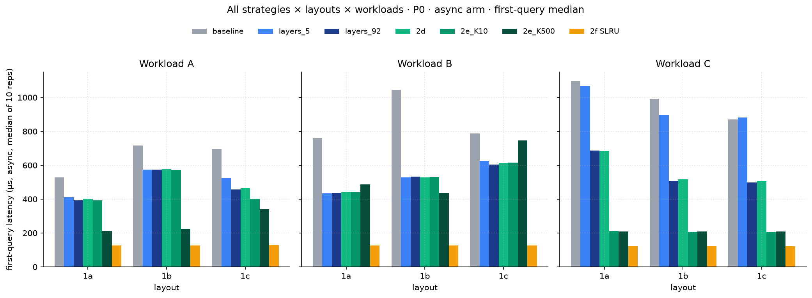

*圖 5:每個 workload × layout 下各 strategy 的 async first-query (越短越好)。
first-q 上 2f 全部最低,但 e2e 要看 §5.5 的兩個部署模型，warm-process 下 targeted prefetch 三 workload 皆贏。*

### 5.2 Best combination on Workload A

**（async delivery mode,median;完整表見 [overall_results.md](https://github.com/wongzinc/sqlite-research-project-sharing/blob/main/overall_results.md)。`open`=冷 open(db)、`deliver`=prefetch syscalls;`e2e_std`=fq+open+deliver、`e2e_warm`=fq+deliver。）**

Workload A、layout orig（µs）:

| 做法 | first-q | open | deliver | e2e_std (vs base) | e2e_warm (vs base) | warm e2e 跨 10 seed (CI, verdict) |
|---|---:|---:|---:|---:|---:|---:|
| baseline（不 prefetch）| 529 | 0 | 0 | **529** (—) | **529** (—) | — |
| layers_5 | 412 (−22%) | 193 | 68 | 671 (+27%) | **480 (−9%)** | **−5%** [−16,+4] 6/10 · **tie** |
| 2d | 401 (−24%) | 194 | 86 | 680 (+28%) | **487 (−8%)** | **−25%** [−29,−20] 10/10 · robust |
| 2e_K10 | 393 (−26%) | 193 | 97 | 685 (+29%) | **490 (−7%)** | **−36%** [−50,−23] 10/10 · robust |
| 2f_slru | 127 (−76%) | 193 | 7007 | 7327 (+1285%) | 7134 (+1248%) | +744% [+662,+870] 10/10 · robust(worse) |

> **觀察**:在 A 這種 baseline 本來就快(~529 µs)的 cell,**standalone warmer 的 cold open db(~193 µs) + deliver 超過 first-query 省下的時間 → `e2e_std` 比 baseline 慢(+27~29%)**；但在 warm-process 模型中,baseline 與prefetch **雙方都不需要 open**,因此prefetch策略能勝出的純粹原因,是其**首查延遲的縮減量(first-query improvement)大於prefetch資料傳遞的開銷(delivery cost)** → **`e2e_warm` 比 baseline 快 7~9%**。`open_us`(~200 µs)只決定 `e2e_std` 與 `e2e_warm` 兩個模型之間的差距,並**不**決定 warm-process 模型內prefetch對 baseline 的勝負(§3.4 / §5.5)。2f 因 deliver ~7 ms,兩模型都遠輸。

> ⚠️ **跨-seed 校正（§6.2.4）**:此表為單一 workload(`results/main`),而該抽樣恰好給了 A 一個偏便宜的第一筆查詢。跨 **10 個 seed**,A 上的 **access-pattern prefetch 其實是 robust 的更大勝**——**2d −25%(CI [−29,−20])、2e_K10 −36%([−50,−23]),皆 10/10 seed 改善**;反觀 **structural `layers_5` 的 −9% 並不 robust**(跨 seed −5%[−16,**+4**]、僅 6/10 同號 → **tie**)。亦即單一 workload 在 A 上同時**低估了 targeted、又高估了 layers_5**;robust 的勝負以 §6.2.4 的 cross-seed CI 為準。

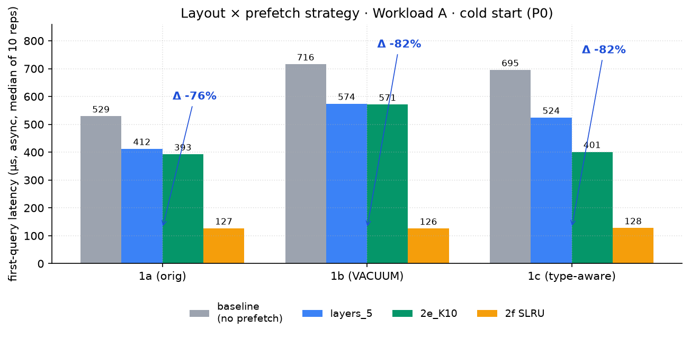

*圖 2:Workload A、async first-query,各 layout 的 baseline 與strategy(2f ≈ −79% first-q)。注意 first-query 與 end-to-end 的結果不同(見上表)。*

### 5.3 Workload-dependent benefit ceiling

first-query improvement上限(orig,vs baseline):

| scenario | 只載 interior(layers/2d) | + hot leaves / 全 working set | 原因 |
|---|---:|---:|---|
| **A**（熱門集中）| −22~26% | 2e_K500 −60% / 2f −76% | hot leaves 多半已 warm， interior-only 即有中段效益 |
| **B**（uniform 隨機讀）| −42~43% | 2f −83% | 每筆打 cold leaf，interior-only 卡在 ~−43%,只有整份 dump 才壓得低 |
| **C**（查file tail新資料）| −37~38% | **2e_K10 −81%** / 2f −89% | 每筆 cold leaf,但 **「access-pattern」加載 top-K hot leaves 可突破**到 −81% |

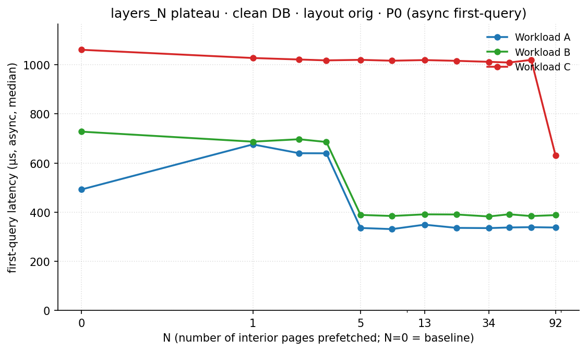 

*（clean DB、layout orig、async first-query；A/B 在 N=5 落底、C 需 N=92。3-layout 版見 Figure 11、churned-DB 版見 Figure 12。）*

*圖 4：N（prefetch 多少個 interior page）對 first query 的影響。**A 在 N=5 就到 plateau**，**此 plateau 描述的是「跑完整段 workload 的 avg latency / steady-state」**：first-q 時 leaves 跟 interior 同樣是 cold（cold-start protocol DONTNEED 全清），layers_5 在 first-q 只移除 interior fault，仍付一次 leaf fault；**跑開後** hot keys 對應的 leaves 自然 warm-up、interior 才成為唯一反覆需要且 shared 的 bottleneck，所以 prefetch 專攻 interior 就夠。**B/C 要到 N≈92 才壓住** first-q 是因為它們每筆 query 都打不同 cold leaf、沒有自然 hot leaves 可依賴。Churn 不改變此 plateau 的形狀。*

### 5.4 Access-pattern frugality on Workload C

不是盲目載前 N 個，而是**先 observation 哪些 page 真的被用到**，再只載那些。實驗，Workload C、layout orig(baseline 1096 µs):

| 做法 | first-q | first-q imp | open | deliver | e2e_std | e2e_warm | warm e2e 跨 10 seed (CI, verdict) |
|---|---:|---:|---:|---:|---:|---:|---:|
| 載全部 interior（layers_92）| 687 | −37% | 222 | 196 | 1103 (+1%) | 881 (−20%) | −21% [−22,−19] 10/10 · robust |
| 只載真正用過的 interior（2d）| 684 | −38% | 221 | 68 | 975 (−11%) | 753 (−31%) | −36% [−39,−33] 10/10 · robust |
| **+ 最 hot 的 10 個 leaf node（2e_K10）**| **211** | **−81%** | 222 | 80 | **512 (−53%)** | **291 (−73%)** | **−70%** [−72,−69] 10/10 · **robust** |

> **觀察**:C 上「只載 interior」(2d/layers_92) first-q −37~38%、`e2e_warm` 已 −20~31%;
> **真正解鎖的是加載 top-10 hot leaves(2e_K10)**，把 first-q 壓到 211 µs(−81%)、
> **`e2e_warm` 291 µs(−73%)/ `e2e_std` 512 µs(−53%)**，全矩陣最佳 e2e。三者 deliver 都小
> (~70–200 µs)、冷 open ~220 µs,所以 e2e 由 first-q 決定，而 2e_K10 的少量 hot leaf 是最有效益的選擇。
> **此 −73% 是全研究最穩健的勝負**:經 **10-seed** 驗證為 warm e2e **−70%(CI [−72, −69])、10/10 seed 皆改善**(§6.2.4)。

#### 5.4.1 三槓桿 ablation：C 的勝利來自 access-frequency，不是 page-type（S1）

§5.4 的 2e_K10 把 C 的 first-q 從 2d 的 −38% 再壓到 −81%——多出來那 −43 點，到底是「page-type 感知」還是「access-frequency 選 hot leaf」？我們把 2e_K10 的 hotset 拆成兩個 selection 槓桿、再加一個對照組(同 layout、同一批跑、10-seed bootstrap CI):

- **2d** = 只載 interior（**page-type** 槓桿）
- **leaf_freq_K10** = 只載 top-10 hot leaves（**access-frequency** 槓桿，= 2e_K10 扣掉 interior）
- **leaf_rand_K10** = 載「**同型別(leaf_table)、同 10 張、但隨機抽的非 hot leaf**」(對照組:差別在「有沒有照頻率挑」)
- **2e_K10** = interior ∪ hot leaves（合併）

集合上 `2e_K10 = 2d ∪ leaf_freq_K10`，是 exact 分解。Workload C、orig、async first-q（10-seed mean Δ% [95% CI]、皆 robust）:

| arm | 隔離的槓桿 | pages | first-q Δ% | e2e_warm Δ% |
|---|---|---:|---:|---:|
| 2d | page-type（interior） | 4 | −43% [−46,−41] | −36% |
| **leaf_rand_K10** | 對照·隨機 leaf | 10 | **−2% [−3,−1]** | +6%(更慢) |
| **leaf_freq_K10** | **access-frequency** | 10 | **−40% [−43,−37]** | −32% |
| 2e_K10 | 合併 | 14 | −81% [−82,−80] | −73% |

**結論:同型別、同張數下,隨機 10 leaves 幾乎無效(−2%),照頻率挑的 10 leaves −40%——這 38 點全是 access-frequency 訊號、與 page-type 無關。** C 的 headline −81% = interior(−43%)疊加 hot leaf(−40%)。對照之下:**B(uniform、無 hot leaf)的 leaf_freq≈leaf_rand≈0,全靠 2d(interior, −36%)扛**;A 居中(leaf_freq −13% robust、leaf_rand 打平,主力仍是 2d −37%)。三 workload 跨 10 seed 皆 robust。

layout 槓桿(orig→ta)只改 deliver 成本、不改上述 selection 故事:ta 把 interior collocate,卻也讓 2d/2e 的 interior 集合變大(C: 4→48 頁),warm e2e 反而略遜(C 2e_K10 orig −73% vs ta −65%),與 §6.1「type-aware layout 非淨贏」一致。全表見 [overall_results.md](https://github.com/wongzinc/sqlite-research-project-sharing/blob/main/overall_results.md) 「三槓桿 ablation」節。


*圖 17:三槓桿 ablation(10-seed mean Δ%、bootstrap 95% CI)。每組 4 條 = 4 個 selection 槓桿;**grey=leaf_rand 對照幾乎貼 0、green=leaf_freq 才是真正出力的那根**(C 最明顯)。e2e_warm 欄裡 leaf_rand 甚至微正(多付 deliver 卻無 first-q 紅利)。故 targeted prefetch 在 C 的效益是 **access-frequency-driven**;page-type 感知負責 interior(撐起 uniform B 與 A 的主力)。*

> **命名校正(回應 R2 W4 / CONSENSUS-2 #9)**:本框架其實同時用了**兩個** selection 槓桿——**page-type 感知**(選 interior,扛 uniform B 與 A 的主力)與 **access-frequency 感知**(選 hot leaf,解鎖 C 的 headline)。單用「page-type-aware」命名會低估後者;準確說法是 **type-aware(interior)＋ access-frequency-aware(hot leaf)的複合 targeting**。

#### 5.4.2 競爭性 baseline：targeted vs 調校過的 ranked dump（RR1 / S4）

§5.5 會說「cache-dump（2f_slru）e2e 輸」,但 2f_slru 是**最 naive 的 blind full-dump**（載整份 ~4400 page working set）。為排除「我們只是贏了稻草人」的質疑,我們補一個**調校過的競爭對手 `2f_topN`**：把 resident working set 按 **traversal frequency** 排序、只 dump 前 N 個（InnoDB `innodb_buffer_pool_dump_pct` 的類比，**完全不用 page-type 知識**——`strategies/access/runs/gen_freqdump.py` replay 每筆 read 的 B+tree root→leaf path 計次）。N 掃 {14, 28, 100, 500, full}，放進同一 e2e accounting，10-seed bootstrap CI。

e2e_warm Δ% vs baseline（async、orig、跨 10 seed mean [95% CI]，footprint = 頁數）：

| arm | footprint | A | B | C |
|---|---:|---:|---:|---:|
| **2e_K10**（targeted） | 14–28 | **−38 [−53,−25]** | **−24 [−31,−12]** | **−72 [−74,−71]** |
| 2f_top14（ranked dump） | 14 | −33 [−43,−24] | −27 [−34,−16] | −57 [−68,−45] |
| 2f_top28 | 28 | −37 [−52,−24] | −26 [−32,−16] | −60 [−69,−49] |
| 2f_top100 | 100 | −32 [−45,−19] | −18 [−32,−4] | −52 [−60,−42] |
| 2f_top500 | 500 | **+81 [34,151]** | **+44 [28,60]** | −13 [−17,−8] |
| 2f_slru（full dump） | ~4400 | **+762 [674,899]** | **+730 [644,848]** | −12 [−17,−7] |

三個結論：

1. **cost-accounting headline 不靠稻草人**：e2e_warm 隨 dump footprint **單調惡化**——full dump 在 A/B 爆到 **+730 ~ +762%**，唯有**小而排序的 partial dump 才贏**（sweet spot 在 N≈14–28）。「dump 整份」輸的不是 dump 機制本身、而是 **dump 太多**；這正是本研究 cost-accounting 要量化的 deliver trade-off。
2. **broad workload（A/B）：page-type 非必要**——tuned `2f_topN`（純頻率、零 page-type）在 matched footprint 下**追平** `2e_K10`（A `2e_K10` −38% vs `2f_top28` −37%、B −24% vs `2f_top14` −27%，CI 重疊；first-q 亦同）。與 §5.4.1 ablation 一致：有效的是 **access-frequency**、不是 page-type。
3. **narrow workload（C）：page-type 仍有價值**——`2e_K10` **−72% [−74,−71]** robustly 勝過 matched `2f_top14` **−57% [−68,−45]**（CI 分離；first-q −81% vs −65% 亦然），且 `2f_top28/100` 加大預算也追不上。機制：C 的 query 很窄，純頻率 top-14 只挑到 **2 個**最 hot 的 interior，而 `2e_K10` 用 page-type 知識**保證載入整個 interior skeleton（4 個）**，在跨 seed 抽樣下對 path coverage 更 robust。

> **綜合**：`2e_K10` **從未被任何 tuned dump 打敗**（broad A/B 打平、narrow C 勝），故 §5.5「targeted > dump」結論**成立且非稻草人勝**。但機制歸因要精確——**勝利主要來自「小 footprint + frequency ranking」（這點 page-type 與純頻率等價），page-type 的額外價值在 narrow workload 下保證 path coverage 的 robustness**。完整表見 [overall_results.md](https://github.com/wongzinc/sqlite-research-project-sharing/blob/main/overall_results.md)「競爭性 baseline」節。


*圖 18：competitive baseline（10-seed mean Δ%、bootstrap 95% CI）。x = dump footprint（頁、log）；`2f_topN`（線）= 純頻率 ranked partial dump，`2e_K10`（★）= page-type＋frequency targeted。**右（e2e_warm）**：footprint 一大、deliver 成本就吃掉一切——full dump（~4400 頁）在 A/B 爆到 +700~800%；小而排序的 dump 才在 0 線下。**★ 落在 A/B 的 partial-dump curve 上（page-type 非必要），但 C 的紅★明顯低於紅線（narrow workload 上 page-type 仍勝）**。*

### 5.5 The preprocessing trade-off （本研究的核心觀察）

前面所有 first-q numbers 都**只算 SQL 第一筆 query 的時間**，但 prefetch 自己也要時間。
**real cold start = preprocessing + first-q**，而 preprocessing 拆成兩個 term:

- **open(db)**: cold start DB 的 setup(~193–222 µs,per-layout 常數)。**只有「另起 standalone warmer process」才需要**；app 已在跑、重用既有 handle (本研究主張的部署)則免。
- **deliver**:迭代 hotset + 逐頁 madvise/pread(隨 hotset 大小:小策略 ~70–200 µs、
  2e_K500 ~0.5–0.85 ms、2f ~0.6–7 ms)。

對應**兩個部署模型的 e2e**:
- **standalone-warmer e2e** = first-q + open + deliver(較嚴苛；另起 process)。
- **warm-process / integrated e2e** = first-q + deliver(本研究主張、≈ static `effective_first_query`)。

**兩種觀點的視覺對比**：

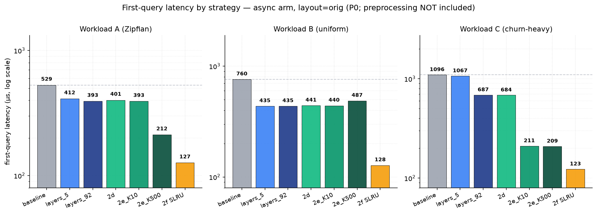

*圖 13：純 first-query latency（async,log scale）。**2f SLRU first-q 全部最低**，既
A/B/C ~123–128 µs(−76~89%)，比 baseline 529–1096 µs 短一個量級。這是 §5.1
「first-q 最低」欄的視覺版本(但 e2e 另有結論，見圖 14)。*

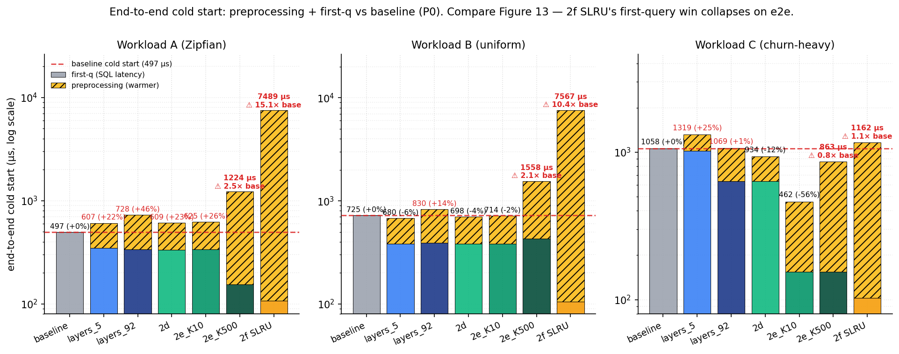

*圖 14：**end-to-end cold start,兩個部署模型**(stacked:first-q + deliver + 灰色冷 open)。
**warm-process e2e = bar 去掉灰色(= first-q + deliver);standalone e2e = 整條 bar 頂**;
灰色那段就是「integrate 進 app 即可省掉」的 cold open db 。每根 bar 標的是 **warm-process e2e 改善**
(綠=贏/紅=輸)。**2f 兩模型都遠超紅線**(A +1248% / B +843%)；但 **warm-process 下 targeted prefetch(layers_5/2d/2e_K10)三個 workload 都在紅線下**(A −7~9%、B −29~34%、C 2e_K10 −73%)。
標 **‡** 的 % (A、B 的 layers_5)代表這個單一 workload 的勝出**落在雜訊內**——10-seed 跨-seed CI 跨 0(§6.2.4),不算 robust;未標 ‡ 的勝負則跨 seed 穩健。即:targeted prefetch 真正跨 seed 守得住的是 **access-pattern(2d/2e)**,structural layers_5 的單格勝出在 A/B 不可恃。*

#### 5.5.1 每種 strategy 的 preprocessing overhead

preprocessing 拆成 **open(db)** 與 **deliver** 兩個 term(warmer 分別自報 `open_us`/`deliver_us`)。orig 代表值:

| strategy | 做什麼 | open(db) | deliver | 主導 |
|---|---|---:|---:|---|
| **2c layers_5** | prefetch 前 5 個 interior | ~193 µs | ~68 µs | open;e2e_warm≈first-q |
| **2c layers_92** | prefetch 全部 interior | ~194 µs | ~190 µs | open/deliver 相當 |
| **2d access-pattern（只 interior）**| 只載用過的 interior | ~194–222 µs | ~68–110 µs | open |
| **2e_K10（interior + 10 hot leaf）**| + 最 hot 的 10 leaf | ~193–222 µs | ~80–124 µs | open |
| **2e_K500（interior + 500 hot leaf）**| + 最 hot 的 500 leaf | ~220 µs | ~0.5–0.85 ms | deliver |
| **2f SLRU（重載前次 cache）**| 載整份 resident working set | ~220 µs | **~0.6–7 ms**(A/B ~7ms、C ~0.76ms) | **deliver 主導** |

> **open(db) 是 per-layout 常數(~200 µs)、與策略無關**，它是 standalone 與 warm-process 兩個 e2e
> 模型的**唯一差**:standalone warmer 另起 process 和 cold start DB；app 已在跑、重用既有 handle 則免。
> deliver 隨 hotset 大小線性（單一 `madvise` syscall ~1–2 µs 是 deliver 的下界）。
>
> **`open_us` 變異與 common-mode 性質（n=810 non-warmup rep）**:整體 median **221 µs**、stdev **17 µs**
> （CV **8%**）、p95 **231 µs**——分佈緊。關鍵是它**與 strategy、layout 皆無關**:逐 strategy median 全落在
> **220–222 µs**（stdev 10–21）、逐 layout（orig/ta/vacuum）皆 ~221 µs。workload 間有小幅差異（A 各策略 ~193、
> B/C ~222 µs,屬跨批機器狀態漂移,§6.2.5），但**同一 cell 內 baseline 與所有 prefetch 策略的 open 相同**——這
> 正是下節 standalone 對齊所依賴的:`open_us` 是冷 open 同一 DB 的固定成本（common-mode）,而**非**某條 prefetch
> 路徑獨有的稅。

#### 5.5.2 end-to-end 表現（兩個部署模型）

對比快(A)與慢(C),`e2e_std`=fq+open+deliver、`e2e_warm`=fq+deliver:

單格為單一 workload(`results/main`);「跨seed」欄為 10-seed warm e2e mean + verdict(§6.2.4)。

| strategy | A e2e_std (base 529) | A e2e_warm | A warm 跨seed | C e2e_std (base 1096) | C e2e_warm | C warm 跨seed |
|---|---:|---:|---:|---:|---:|---:|
| Baseline | **529** (—) | **529** (—) | — | **1096** (—) | **1096** (—) | — |
| 2c layers_5 | 671 (+27%) | **480 (−9%)** | −5% · **tie** | 1360 (+24%) | 1138 (+4%) | +5% · robust(worse) |
| 2d access-pattern | 680 (+28%) | **487 (−8%)** | **−25% · robust** | 975 (−11%) | **753 (−31%)** | **−36% · robust** |
| 2e_K10 (+10 leaf) | 685 (+29%) | **490 (−7%)** | **−36% · robust** | 512 (−53%) | **291 (−73%)** | **−70% · robust** |
| 2e_K500 (+500 leaf) | 1238 (+134%) | 1044 (+97%) | +79% · robust(worse) | 921 (−16%) | 700 (−36%) | −31% · robust |
| **2f SLRU** | 7327 (+1285%) | 7134 (+1248%) | +744% · robust(worse) | 1114 (+2%) | 892 (−19%) | −9% · robust |

> ⚠️ **跨-seed 校正（§6.2.4）**:上表 warm e2e 為單一 workload。經 **10-seed** 驗證,**access-pattern targeted prefetch 三 workload 皆 robust**——**C 2e_K10 −70%[−72,−69]、A 2e_K10 −36%[−50,−23]、B 2d −25%[−32,−16]**(CI 皆不跨 0、≥9/10 同號);唯 **structural `layers_5` 在 A/B 落在雜訊內**(A −5%[−16,+4] tie、B −1%[−12,+7] directional)。故「targeted prefetch 三 workload e2e 皆改善」的 headline 成立,但其 robustness 來自 **access-pattern(2d/2e)**、而非 structural layers_5。

**open 是 common-mode、不是 prefetch 稅(standalone 對齊對照)。** 上表 `e2e_std` 對 **bare baseline** 比,在快 workload A 看似 prefetch 普遍變差（layers_5 **+27%**、2e_K10 **+29%**）。但這是把 open **只**算給 prefetch 的假象:一個 standalone 的 **baseline** 同樣得先冷 open 那個 DB。把 baseline 放到同一 standalone 基準——`baseline+open`（open 取 per-workload median **A 193 / C 222 µs**;baseline 本身以 warm-process 量得故 open 未直接測,此值**deduced** 自 prefetch 各策略,因上節已證 `open_us` 與策略無關）——open 在兩邊**相消**(e2e_std 取自 §5.5.2 表的 async `e2e_median`):

| cell | e2e_std | vs **bare** base | vs **base+open**（standalone 對齊） | 對照 e2e_warm vs base |
|---|---:|---:|---:|---:|
| **A baseline+open (standalone)** | **722** | — | — | — |
| A layers_5 | 671 | +27% | **−7%** | −9% |
| A 2d | 680 | +28% | **−6%** | −8% |
| A 2e_K10 | 685 | +29% | **−5%** | −7% |
| **C baseline+open (standalone)** | **1318** | — | — | — |
| C 2e_K10 | 512 | −53% | **−61%** | −73% |
| C 2d | 975 | −11% | **−26%** | −31% |

> 在同一 standalone 基準下,prefetch 對 baseline 的**絕對**優勢與 warm-process **近乎相同**(代數上 `e2e_std −(base+open)` = `e2e_warm − base` = `deliver + Δfirst-q`,open 不出現;殘差 ≤ 數 µs,源於各策略 open 的 median 微差)——兩個 standalone-對齊欄與 e2e_warm 欄同號、量級一致,只因分母不同（722/1318 vs 529/1096）而百分比略有出入。故 §5.1/§5.5.3 所說「standalone 下快 workload 的 prefetch 紅利被冷 open 抵銷」精確的意思是:prefetch 省下的 first-query 時間**不足以額外 cover 它自己付的那一次 open**（2e_K500/2f 則是 deliver 過重才真輸,與 open 無關),而**非** open 是 prefetch 獨有的開銷——open 只是平移兩個部署模型共同的零點。

#### 5.5.3 three-line takeaway

1. **「重載前次 cache」(2f SLRU) first-q 最低(−76~89%)但 e2e 多半不具優勢**，其 deliver
   (載整份 working set)A/B ~7 ms 使 e2e 比 baseline 慢一個量級（兩模型皆是）;只有 **C(deliver
   ~0.76 ms)warm-process e2e −19%** 才小贏。first-q 優秀但會產生 misleading，real cold start 要看 e2e。
2. **targeted prefetch(layers_5/2d/2e_K10)的 e2e 取決於部署模型**:**standalone**(含 ~200 µs 冷 open)
   在快 A 輸(+27~29%)、慢 C 贏；**warm-process**(handle 已開、≈ static)**三個 workload 都贏**
   (A −7~9%、B −29~34%、C 2e_K10 −73%)。在 warm-process 中 baseline 與 prefetch **雙方都不付 open**,故勝出的純粹原因是 **first-query improvement > delivery cost**;`open_us` 只決定 standalone 與 warm-process 兩模型之間的差距,不決定 warm 模型內 prefetch 對 baseline 的勝負。
3. **本研究主張 warm-process**(app 已在跑、prefetch 重用既有 handle):此時 targeted prefetch
   全面有效益；2f 仍因 deliver 過重不適合 cold-start critical path(只適合 batch、或 C 類小 working set)。
   部署形式(integrate vs standalone warmer)就是決定 e2e 表現的關鍵。

> Cadence(圖 8)是同一條 trade-off 的時間版:background warmer 每 cadence 秒 re-warm 一次。
> 實測 **cadence=1s/5s maintain first-q ~26/29 µs**(warm)；**cadence=30s/never 退到
> ~281/305 µs**(≈ 沒 prefetch)。即「**依在意 first-q 還是 overhead,在 frontier 上選一點**」,
> 而非「兩個 metric 各有best cadence」。

---

## 6. Discussion

### 6.1 Key findings recap

跨整個實驗 matrix 看到的structure性 finding（robustness 驗證在 §6.2）：

1. **N（prefetch 幾個 interior）的形狀因 (workload, layout) 而異**：dense N-sweep
   (async)顯示 A/Z 在 **N≥5 即 plateau ~−30%**(orig)；**N=1 反而比 baseline 慢
   ~+31%**(warmer/madvise overhead > coverage)；B 全 plateau **~−47%**(leaf-fault dominate);
   **C 要 N=92 才到 −40%**(hot interior 在 file 中段、按 offset 取前 N 選錯 page)。
   沒有「N=5 universal sweet spot」這種單一結果，best N 跟 layout/workload 綁定。
2. **沒有 general best strategy**:first-query 上 2f 全部最低(−76~89%)，但看 e2e 時要視
   deliver 大小與部署模型(見 #3、§5.5)。
3. **e2e 取決於部署模型 + deliver 大小**：**standalone warmer** (另起 process、付 ~200 µs 冷 open)下,
   快 workload(A)上 targeted prefetch 的 e2e 不優於 baseline(+27~29%)、只有慢 C 贏;但
   **warm-process / integrated**(app 已在跑、重用 handle、不做 cold open db)下,**targeted prefetch 三個 workload 的 e2e 都有改善**(單一 workload:A −7~9%、B −29~34%、C 2e_K10 −73%)。
   **這個 headline 經 10-seed sweep 驗證成立,但穩健性來自 access-pattern(2d/2e)而非 structural layers_5**(§6.2.4):跨 seed **A 2e_K10 −36%[−50,−23]、B 2d −25%[−32,−16]、C 2e_K10 −70%[−72,−69] 皆 robust**;而 **structural layers_5 在 A/B 落在雜訊內**(A tie、B directional)。
   warm-process 中 baseline 與 prefetch **雙方都不付 open**,故勝出的純粹原因是 **first-query 縮減量 > delivery 開銷**;`open_us` 只決定兩模型之間的差距,不決定 warm 模型內 prefetch 對 baseline 的勝負。type-aware layout 在 實驗下把 A/B 的 baseline **推高**了(A +31%、B +4%)、C 較快(−21%)。
   **換言之,1c 物理連續性重排是一把雙面刃**:把 interior 集中到檔頭能**放大 structural prefetch(layers_N)在 clustered layout 上的 first-query 改善百分比**(高度傾斜的 A 上 layers_92 可達 first-q −69%),但代價是把 leaf 推到較高 offset、**抬高了以 cold-leaf-fault 為主之 workload 的 no-prefetch baseline**(A 529→695 µs +31%、B 760→788 +4%;唯 file-tail-heavy 的 C 反而 1096→871 −21%)。
   **關鍵是那個「放大的百分比」是 baseline 被墊高的假象,不是更低的絕對地板**:A 上 layers_92 的 pread first-q 地板在 1c(212 µs)與 1a(210 µs)幾乎相同,1c 只是把分母(baseline)墊高才讓 −69% 看起來大於 1a 的 −60%。
   **1c 的明確 net-win 條件(全部需同時成立)**:(i)確定會部署 prefetch、(ii)只能用 structural(layers_N、拿不到 access-pattern residency)、且 (iii)workload 夠傾斜/file-tail-light,使 clustered-interior 的 first-q 絕對增益 > leaf 被推尾造成的 baseline 抬升。**這三條在本研究 A/B/C 任一格都沒同時滿足**:逐格比較**最佳 warm e2e 一律落在 1a(orig)+ access-pattern**(A 481 vs 1c 525、B 504 vs 693、C 290 vs 334 µs),1c 沒有任何一格贏過 orig。
   故 **1c 在本矩陣中實質是一個探索性的負面結果**——理論上有上述窄場景,但在我們測到的所有 workload 上都被「1a + access-pattern prefetch」支配;**建議預設用 1a,不要部署 1c**,除非確認落在上述三條同時成立的窄場景。
4. **慢 workload 上「access-pattern + hot leaf」最有效益**：C 上 interior-only(2d/layers_92)
   first-q −37~38%、warm-process e2e −20~31%；加 top-10 hot leaf(2e_K10) 才解鎖 first-q −81%、**warm-process e2e −73%(291 µs)**，全矩陣最佳。
5. **2f(整份 working set)e2e 多半不具優勢**:deliver A/B ~7 ms 使 e2e 慢一個量級(兩模型皆是);
   只有 C(deliver ~0.76 ms)warm-process e2e 才 −19%。適合 batch、不適合 cold-start critical path。

### 6.2 Robustness checks

驗證所有 §5 結論在多條 robustness 軸下都成立：DB 一直被 write、RAM 被砍掉、多 process
shared、跨 10 個 workload seed（§6.2.4）、以及 DB 放大 10× 到 ~1 GiB（§6.2.5）。

#### 6.2.1 Churn evolution（DB 被持續 write 後）

DB 被持續 write（**50k mutation = 10 輪 × 5k**，在 11 個 checkpoint ck0–ck10 上量測，ck0 = t=0 baseline）後，**static t=0 hotset
完全沒 decay**:實驗量到 C 上 2e_K10_static 跨 checkpoint maintain ~82–86 µs(vs baseline ~580 µs)，ck0→ck10 無上升趨勢；三 layout(orig/vacuum/ta)皆然。

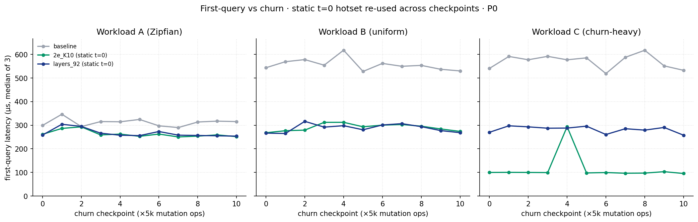

*圖 7：DB 被持續 write 後,static t=0 hot pages 在 A/B/C 三種 workload 上都不 decay
(主面板 = layout orig;CSV 另含 vacuum/ta)。C 上 2e_K10_static 跨 11 個 checkpoint
持平 ~82–86 µs;B 上沒有自然 hot leaves，access-pattern 與 structural 打平，但同樣不 decay。*

#### 6.2.2 RAM pressure（cap 壓到 working set 以下）

RAM pressure 的關鍵不是「cap 多小」，而是**cap 相對 working set 的位置**。本研究的 resident
working set（跑完 100k ops 後 resident 的 page 數）量到 **A/B ≈ 4.4k page ≈ 17.3 MB、C ≈ 0.46k
page ≈ 1.8 MB**。早期用的 `MemoryMax=20M` **在 A/B working set 之上**，所以 first-query 的
「20M / unlimited」ratio 全部落在 **0.95–1.07**（圖 6）——那不是「prefetch 抗壓」，而是**根本沒施壓**。


*圖 6：cap=20 MB（> working set）時 async first-query 的「20M / unlimited」ratio 全落在 0.95–1.07
——cap 在 working set 之上，沒有實質 reclaim。要看真壓力得把 cap 壓到 working set 以下（圖 16）。
（unlimited 分母取自**同 session** 的 unconfined run、非 `results/main`，以免跨-session 機器狀態漂移造成 ~0.85 的假象。）*

**把 cap 沿 working set 以下逐級壓**（`{∞, 16M, 12M, 8M, 6M}` = `{∞, 0.92, 0.69, 0.46, 0.35}×WS`，
workload A/B、**六策略全掃**（layers_5/2d/2e_K10/layers_92/2e_K500/2f_slru）、量 `delivery_pct`＝prefetch
過的 page 在 first-query 前的 mincore 殘留率；`tools/ram_pressure.sh`、資料
[`results/ram_pressure/`](results/ram_pressure/)）後，**策略間出現極大分歧**：

| 策略（hotset 大小） | delivery_pct：∞ → 16M → 12M → 8M → 6M | first-q：∞ → 受壓 | 結論 |
|---|---|---|---|
| **layers_5**（~20 KB） | 100 → 100 → 100 → 100 → 100% | 389 → ~355–390 µs（平） | **完全 robust** |
| **2d**（~16–72 KB） | 100 → 100 → 100 → 100 → 100% | 356 → ~330–360 µs（平） | **完全 robust** |
| **2e_K10**（112 KB） | 100 → 100 → 100 → 100 → 100% | 360 → ~360 µs（平） | **完全 robust** |
| **layers_92**（368 KB） | 100 → 100 → 100 → 100 → 100% | 356 → ~360 µs（平） | **完全 robust** |
| **2e_K500**（2.07 MB） | 100 → 100 → 100 → 100 → 100% | 182 → ~181 µs（平） | **完全 robust** |
| **2f_slru**（17.7 MB＝整個 WS） | 100 → **77 → 54 → 26 → 20%** | 98 → **~490 µs（≈ baseline 502）** | **崩潰** |

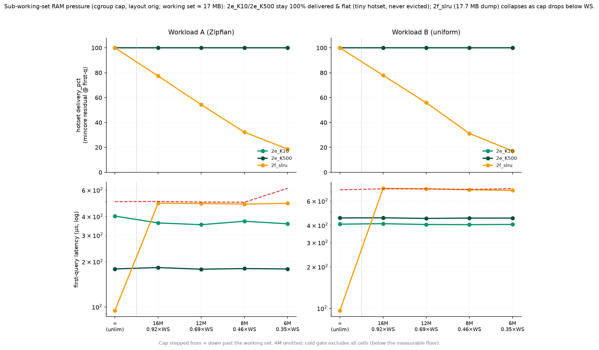

*圖 16：cap 壓到 working set 以下。**上排 delivery_pct**：五條 targeted 策略（layers_5 ~20 KB、
2d ~16–72 KB、2e_K10 112 KB、layers_92 368 KB、2e_K500 2 MB）全程釘在 100%——hotset 比任何可用
cap 小好幾個量級、永遠不被 evict；**2f_slru（17.7 MB dump）的 delivery 隨 cap 線性塌**（≈ cap/WS）。
**下排 first-q（log）**：2f 一旦 delivery 跌破 100%（16M 起），first-q 就從 98 µs **直跳回 baseline
（紅虛線）並維持**——「整碗端走」式 cache-dump 沒有 graceful degradation，是 all-or-nothing；五條
targeted 則完全平。B（uniform）同形。*

**結論（呼應全文主軸）**：在記憶體受限裝置上，**「小而準」的 targeted prefetch（≤2 MB hotset）對
RAM pressure 是 robust by construction**——這裡把**全部五條 targeted 策略**（layers_5/2d/2e_K10/layers_92/2e_K500，
非只抽樣兩三條）都掃過，每條在 A/B 都**實測** 100% delivery、first-q 全程平（實測、非演繹推論）；
hotset 太小、reclaim 碰不到它，first-query 效益完整保留；
而**「大而全」的 cache-dump（2f_slru，hotset＝整個 working set）一旦 RAM 低於 working set 就當場崩**——
RAM 受限是 mobile/IoT 部署關注的情境,但**本量測是在桌機上以 cgroup `MemoryMax` 模擬施壓、非實機**(平台 scope 見 §6.4)。可用量測下限約 **6 MB（0.35×WS）**；4 MB 以下 cold gate 全排除、量不出。
C（WS 僅 1.8 MB ≈ 量測下限）**無法以 cgroup 施壓 → 其 RAM-robustness 為演繹推論（hotset/WS 小於可量測下限、reclaim 碰不到）、非實測**；要對 file-tail workload 取得真正的 sub-WS datapoint，需構造放大-WS 的 C 變體（future work）。

#### 6.2.3 Multi-process MAP_SHARED

一個 process 做 prefetch，所有 shared 同一份 cache 的 process 都受惠。


*圖 8：background warmer 每 cadence 秒re-warm、前景每 probe 做全機 drop-caches 後量first-query。
**Cadence 是一個 trade-off 參數**：cadence=1s/5s maintain first-q ~26/29 µs、cadence=30s/never
退回 ~281/305 µs(≈ 沒 prefetch)。若要維持 first-q warm,cadence 需 ≤ query 間隔;若要節省cost則加大 cadence (代價是 first-q 退回 cold)。視部署在意哪個目標而定。*

#### 6.2.4 Workload-instantiation sensitivity（10 seeds）

把 A/B/C 各用 **10 個 random seed** 重生成（同一份 DB、同 reps）、各跑一次完整 matrix，量每個被宣稱勝負的**跨-seed 效應 95% CI**（method 見 §3.7；warm-process e2e、async、layout orig）。三個關鍵 finding：

1. **旗艦結果 robust**：C × 2e_K10 的 warm-process e2e 跨 10 seed = **−70%（CI [−72, −69]）、10/10 seed 皆改善**（原單一 workload 報 −73%，一致）。

2. **headline「三 workload 用 targeted prefetch 都贏」站得住**：每個 workload 的最佳 access-pattern 策略跨 seed 皆 robust——**A 2e_K10 −36%（[−50, −23]）、B 2d −25%（[−32, −16]）、C 2e_K10 −70%（[−72, −69]）**，全部 CI 不跨 0、≥9/10 同號。

3. **落在雜訊內的是 structural `layers_5`（A/B），不是 targeted 策略**：A layers_5 warm e2e **−5%（[−16, **+4**]）、僅 6/10 同號 → tie**；B layers_5 **−1%（[−12, **+7**]）→ directional**。即「只載前 N 個 interior」這個 structural 捷思，其 **e2e 效益高度受 workload 抽樣影響**（部分 seed 反而變慢）；access-pattern 的 2d/2e 則無此問題。

| cell（warm e2e, orig） | 單一 workload | 跨 10 seed mean | 95% CI | sign | verdict |
|---|---:|---:|---:|---:|---|
| **C 2e_K10** ⭐ | −73% | **−70%** | [−72, −69] | 10/10 | **robust** |
| C 2d | −31% | −36% | [−39, −33] | 10/10 | robust |
| A 2e_K10 | −7% | **−36%** | [−50, −23] | 10/10 | robust |
| A 2d | −8% | **−25%** | [−29, −20] | 10/10 | robust |
| B 2d | −31% | −25% | [−32, −16] | 9/10 | robust |
| B 2e_K10 | −29% | −25% | [−30, −16] | 9/10 | robust |
| **A layers_5** | −9% | **−5%** | [−16, +4] | 6/10 | **tie** |
| **B layers_5** | −34% | **−1%** | [−12, +7] | 8/10 | directional |

**方法學教訓**：**單一 workload 的點估計可能不具代表性**。原 `results/main` 恰好替 workload A 抽到一個「便宜的第一筆查詢」（baseline first-q ~520 µs，vs 跨 seed 典型 ~900 µs），因而**低估**了 A 上 targeted prefetch 的真實效益（報 −7~9%，實際跨 seed −25~36%），同時**高估**了 B layers_5（報 −34%，實際 ~0）。兩個方向的偏差都只有靠多 seed 才看得出來——這正是本次修訂補做 10-seed sweep 的價值。完整 54-cell × 3-metric 跨-seed 表見 [overall_results.md](https://github.com/wongzinc/sqlite-research-project-sharing/blob/main/overall_results.md)。

#### 6.2.5 DB-size scaling（102 MB → ~1 GiB，hot set 遠小於 DB）

前述結果都在 102 MB reference DB 上。為驗證「當 DB **遠大於** hot working set 時 prefetch 是否還靈」，我們把 DB 放大到 **6,000,000 row（~1 GiB、263,991 page）**，用**同一份 seed-1 query stream**（即原始 workload）讓 `orig`(100 MB) 與 `1gb` **在同一批次** rep-major 量測（A/B/C/Z × 6 strategy），並把 §6.2.4 的 10-seed 不確定性分析**原樣套到 1gb**（A/B/C × 10 seed）。兩個 finding：

1. **冷啟動 first-query 的 prefetch 效益 size-robust**：18/18 個 (workload×strategy) cell 跨尺寸**方向一致、且 1gb 全部 `robust`**（CI 不跨 0）。`2f_slru` 兩尺寸都收斂到 ~96–98 µs——first-query 只看 hot working set、**與 DB 大小無關**；小 hotset 的 **2d / 2e_K10 在 1gb 改善反而更大**（A 2d first-q −35%→−55%），因為同一批 hot key 散到 6M-row DB 的更多 page、no-prefetch baseline 的冷讀更分散更貴，targeted prefetch 相對更划算。`2e_K500/A` 甚至從 100 MB 的 `directional` 在 1gb 收成 `robust`（大 DB 讓效應更乾淨）。

2. **部署 e2e 的 size 敏感性集中在窄域 workload C**：C 的 resident working set 隨 DB 變大而**膨脹**（483→**984** page，窄域 key 在大 DB 散得更開），deliver 成本翻倍，把幾個「靠少量 deliver 取勝」的策略**由贏轉輸**且跨 10 seed `robust`：**`2f_slru/C` warm e2e −9% → +139%**（100 MB 唯一能讓 cache-dump 在 e2e 取勝的格，到 1 GB 確定變大輸）、`2e_K500/C` −31% → +35%、`layers_92/C` −21% → +7%。對照之下，**access-pattern 的 2d / 2e_K10 兩尺寸 e2e 都穩贏**（C 2e_K10 −70% / −68%）。

即本研究主張的「小而準 targeted prefetch」在 DB 放大 10× 後**依然成立**，並**更突顯** cache-dump 式 2f 的 deliver 陷阱會**隨 DB 規模惡化**。（機器狀態：1gb 批跑在 full-boost 乾淨態，`2f_slru` anchor 跨 10 seed 維持 98–100 µs、內部極穩；其絕對 µs 自成一個尺度，與 §5 / §6.2.4 的 ~126 µs 批屬不同機器狀態、**僅跨批比相對量**——詳見 §6.4 與 [overall_results.md「資料可比性」](https://github.com/wongzinc/sqlite-research-project-sharing/blob/main/overall_results.md)。資料：`results/size_1gb/`、`results/seeds_1gb/`、`results/stats/uncertainty_1gb.csv`。）

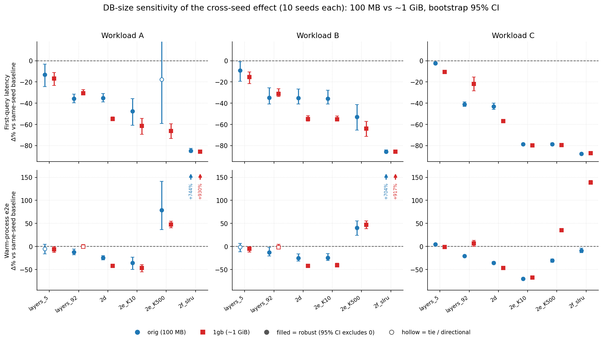

*圖 15：1gb 與 orig 各 **10 seed** 的跨-seed 效應（strategy vs 同 seed baseline 的 Δ%）± bootstrap **95% CI**；
實心 = robust（CI 不跨 0）、空心 = tie/directional。因效應是同 seed 相對量，機器狀態漂移自動抵消、兩尺寸可直接比。
**上排 first-query**：18 格全為負、兩尺寸方向一致 → 冷啟動效益 **size-robust**（orig `2e_K500/A` 的 directional
在 1gb 還收斂成 robust）。**下排 warm-process e2e**：size 敏感集中在窄域 **workload C** —— `2f_slru/C` 由 −9%(orig)
翻成 **+139%**(1gb)、`2e_K500/C` −31%→+35%、`layers_92/C` −21%→+7%（由贏轉輸）；A/B 的 `2f` 兩尺寸都是
+700~930% 大輸（頂部箭頭標值）。對照之下 access-pattern 的 `2d`/`2e_K10` 兩尺寸 e2e 皆穩贏。*

### 6.3 Practical recommendations

| scenario | 建議做法 | First-q improvement | End-to-end（warm-process / standalone）|
|---|---|---|---|
| **慢 workload(查file tail/churn,baseline 高)** | access-pattern:interior + 最 hot 的 ~10 leaf(2e_K10) | **−81%**(C) | **warm e2e −73%(291µs)** / std −53%，全矩陣最佳 |
| uniform 隨機讀(uniform) | structural layers_5 / 2d | −42~43%(B) | **warm e2e −29~34%** / std ≈ 打平 |
| **快 workload(熱門集中,baseline 已快)** | **access-pattern 2d / 2e_K10**(robust);避免單用 structural layers_5 | −22~26%(A) | **warm e2e:targeted 跨 seed −25~36%(robust);layers_5 −5% 落在雜訊內(tie)**。standalone 下 +27~29% 反而較慢 |
| Batch / 平均 latency 場景 | 重載前次 cache(2f SLRU) | −76~89%(first-q) | **e2e 多半不具優勢**(deliver ~0.8–7ms);僅適合 batch、或 C 類小 working set(warm e2e −19%) |
| 多 process shared DB | shared cache + background warmer，cadence ≤ query 間隔 | cost固定、效益乘 process 數 | cadence=1s maintain first-q ~26µs |

> 三條原則:(1)**2f SLRU 的 first-q 最低但 e2e 多半不具優勢**（deliver 太重）,不適合 cold-start critical path;
> (2)**access-pattern targeted prefetch（2d/2e_K10）在 warm-process 下三個 workload 的 e2e 都有改善,且經 10-seed 驗證為 robust**（A −36% / B −25% / C −70%,CI 皆不跨 0;§6.2.4），既本研究主張的部署;
> (3)**structural `layers_5`(只載前 N 個 interior)的 e2e 效益不穩**——在 A/B 跨 seed 落在雜訊內(tie/directional),要用就搭 access-pattern,別單靠它。

### 6.4 Limitations

- **Machine-state drift across sessions**：clean DB 上同個 cell 跨 session 的絕對 µs 可能差 30-70%（同 harness、同 DB、同 code），來自 SSD internal SLC
  cache / wear leveling 狀態漂移 + CPU boost/熱況 + 機器整體background負載。我們用 machine-independent 的 **`2f_slru` first-query 當跨-session 錨點**（它載整份 working set、first-q 與「查哪個 key」無關）：整個研究跨各批次落在 **~96–127 µs（≥4 個機器狀態群）**。對策是「所有要互相比較的數據都在同一個 batch 內跑」（同批一致性 < 5%）；**跨批次只比相對效應（impr% / 跨-seed Δ% / ratio），絕對 µs 不跨批逐格對**（完整錨點表與規則見 [overall_results.md「資料可比性」](https://github.com/wongzinc/sqlite-research-project-sharing/blob/main/overall_results.md)）。Page fault 數量完全 reproducible，只是 per-fault 時間飄。
- **Sample size**：每 cell async 10 reps、pread 5 reps、baseline 10 reps
  (丟第 1 rep warmup)、rep-major;sweep/RAM 批次 async 3–5 reps。報 median(+p95 when n≥4)。
- **「Warm process, cold data」cold-start 模型**（§2.2）：跟「process from
  scratch」差約 1–3 µs,對 baseline ~530–1096 µs 來說 < 1%。本研究的 e2e 即以此模型為主
  (`e2e_warm`,prefetch 重用既有 handle)。
- **Preprocessing 兩個部署模型(§5.5)**:preprocessing 拆成 `open_us`(冷開 DB ~200 µs,per-layout 常數)
  與 `deliver_us`(隨 hotset)。**`e2e_warm` = deliver+fq**(warm-process,本研究主張)、**`e2e_std` = open+deliver+fq**
  (standalone warmer)。兩者唯一差是 `open_us`;報告兩者並陳,結論以 warm-process 為主。
  `read_ahead_kb` 固定 128(主值);{0,64,512} 掃描需 root 寫 sysfs、本環境無權限故未跑,因此 §3.5.1
  把 async/pread gap 的「readahead-warming」成因標為**待驗證的 labeled conjecture**(robust 結論「gap 為真實
  成本差、非時序假象」不受影響,另有兩種模式 `majflt` 相同 + 50 ms 補不回兩項獨立證據)。
- **async delivery 損失非量測時序假象（§3.5.1）**:harness 在 warmer return 後立刻量 first-query。
  我們用 intermediate-delivery sweep(hint 後插 5/20/50 ms sleep 再 query)驗證:hotset 在 sleep=0 就
  100% 落地,且 Workload A 殘餘的 `fq_async − fq_pread` gap(~165–196 µs)給 50 ms 也補不回(兩種模式
  majflt 相同)。故 §5 的 async e2e 數字**不因緊湊時序而偏悲觀**;`fq_pread` 是 async「光等」到不了的理想線。
- **Workload coverage**：A/B/C 是合成的三種 access pattern;**workload-instantiation 敏感度已用 10-seed sweep 量化**(§6.2.4,access-pattern targeted prefetch 跨 seed robust、structural layers_5 在 A/B 落雜訊內)。但這 10 seed 仍是同三種「分佈家族」的不同抽樣;real world 行為可能更複雜（mixed read/write、time-of-day 變化、跨分佈家族),留待後續驗證。
- **未測「真正 cold reboot」cold start**：受限於 sudo 權限與機器shared，沒做「每筆量都 reboot」的嚴格 cold start。harness `--sqlite-open-timing=after-cold`
  可以模擬部分（重 open SQLite handle）。
- **Platform scope = commodity x86 桌機 + NVMe（mobile 未量測）**：所有實驗在同一台 Ryzen 9950X + NVMe、單一 kernel(6.17) 上跑。**本研究的實證結論 scope 限於此類 commodity desktop NVMe 平台。** 行動裝置/IoT 是 SQLite 普及與本問題的 motivation 背景,但 mobile 的 storage stack 在多個維度與本平台不同——UFS/eMMC 的 I/O latency 與 queue 行為、不同的 `read_ahead_kb` 預設、ARM page size、以及更受限的 RAM——這些都可能改變 selection–delivery 的 trade-off 點。本研究**未在 ARM/UFS/eMMC 上量測**,故絕對 µs 與策略間相對排序均不應外推至 mobile;一台 ARM/UFS SBC 上重跑 A/C × {baseline, 2e_K10} 的關鍵 cell 是直接的後續驗證(future work)。

---

## 7. Future Work

- **Type-aware Physical Segregation (Level 2)**：把 type-aware layout 從
  filesystem 層下放到 NVMe SSD 層（用 NVMe Stream Directives 把 interior /
  leaf 分到不同 SSD line/namespace），讓 SSD GC / wear leveling 不會打亂
  layout。在 FEMU SSD emulator 上做（PoC spec 已備）。
- **Strict cold-start 模式**：跑 `--sqlite-open-timing=after-cold +
  --schema-init-timing=after-cold` 一輪，quantify「warm process cold data」跟
  「full cold」之間的 µs 差距，把 §2.2 的「約 1-3 µs」換成精確 numbers。
- **額外 workload 驗證**（後續工作）：600 個額外 workload
  ({read,scan} × {uniform,zipf} × {full,window,tail} × 50 seeds) 跑過後，
  驗證 §5 結論的 robustness。
- **Independent verification**（後續工作）：在不同 machine / SSD 上重跑關鍵 cell，quantify 我們 §6.4 「machine drift」估計的可信度。
- **NVMe SSD page-aware GC 影響**：long-term 跑 large churn (multi-million
  ops)，看 SSD internal GC 對 interior page layout 的影響。
- **Continuous prefetch / steady-state hot-set maintenance**：本研究的
  prefetch 為 cold-start 一次性事件（每次 ~92 `madvise(WILLNEED)` call、
  單 process）。若擴展為持續性 daemon 不斷依 `mincore()` snapshot 維護
  hot-set（cadence ↓ 至 10 ms、hot-set ↑ 至 10K page），總 madvise frequency 將進入 **>1 M ops/s** regime，剛好踩進 [Leis+23] 解的 TLB shootdown 與
  page allocator scalability 邊界。然而 [Leis+23] 的 fix（**exmap** Linux
  kernel module）需 **root 權限** + `modprobe` 部署，與本研究 application-
  side 非侵入式部署 hypothesis 不相容；若要追求 continuous prefetch 方向，需重新
  evaluation 部署模型（可接受 kernel module）或與 [Leis+23] 做 kernel-level
  co-design。本研究刻意把 design point 鎖在「低頻 + 無 root」這個角落，與 [Leis+23] 的「高頻 + kernel module」角落在 design space 上正交，互為補集。

---

## 8. Conclusion

SQLite cold start 後 first query 很慢，因為要先從 disk 讀進關鍵的 **interior
page**。我們用 **prefetch（提前 load）** 把它們先放進 memory。**結論**
(完整數字見 §5 / [overall_results.md](https://github.com/wongzinc/sqlite-research-project-sharing/blob/main/overall_results.md)):first-query
最低是載整個 working set 的 **2f_slru(−76 ~ −89%)**，structural **layers_5 / 2e_K10**
用極少 syscall 取得 first-query −22 ~ −81%；但 **end-to-end 取決於部署模型**。我們把 preprocessing
拆成「cold open(db)(~200 µs,per-layout 常數)」與「deliver(隨 hotset)」,並以兩個模型呈現:
**standalone warmer**(另起 process、cold open db)與 **warm-process / integrated**(app 已在跑、重用 handle、
不做 cold open db，即本研究主張的部署)。**在 warm-process 下,access-pattern targeted prefetch(2d/2e_K10)的 e2e 經 10-seed 校正後跨 seed robust**——C 2e_K10 **−70%[−72,−69]**(單一 workload 報 −73%、291µs)、A 2e_K10 **−36%[−50,−23]**、B 2d **−25%[−32,−16]**(95% CI 皆不跨 0);唯 **structural layers_5 在 A/B 落在雜訊內(tie/directional、CI 跨 0)、不可恃**;
2f 則因 deliver ~0.8–7 ms 而 e2e 多半不具優勢(只有 C 的小 working set 例外)。這些結果在 50k write churn、cgroup `MemoryMax=20M` memory pressure、cadence re-warm、10-seed workload sweep、與 DB 放大到 ~1 GiB（§6.2.5）五條 robustness 軸下穩定
(所有 cell `cold_pct`=0)。

更重要的observation：**「重載前次 cache」(2f SLRU) first-q 看似最低(−76~89%)是 misleading**，其 deliver ~0.8–7 ms 比 first-q(~125 µs)大一個量級,**real e2e cold start
多半比 baseline 慢**(A 12×、B 10×;只有 C 的小 working set warm-process 才 −19%)。2f 的價值在
「跑完整段」的 avg latency,不在第一筆。**而 first-q vs e2e、以及「standalone 含 cold open vs
warm-process 不含」這兩層 trade-off，在既有 prefetch literature 中很少被明說**，這既是本研究的核心觀察。

---

## 9. References

### 9.1 Code & Data

| 資料 | 相關來源 |
|---|---|
| 全部實驗數據（strategy×workload×layout + N/K-sweep + RAM + churn + cadence）| [overall_results.md](https://github.com/wongzinc/sqlite-research-project-sharing/blob/main/overall_results.md) |
| 每個strategy的原理與狀態 | [overall_strategies.md](https://github.com/wongzinc/sqlite-research-project-sharing/blob/main/overall_strategies.md) |
| 四種 workload 的定義 | [overall_workloads.md](https://github.com/wongzinc/sqlite-research-project-sharing/blob/main/overall_workloads.md) |
| Figures | [figures/out/](https://github.com/wongzinc/sqlite-research-project-sharing/blob/main/figures/out/) |

### 9.2 External References

**Tools / Code repositories：**

| Resource | Where | 用途 |
|---|---|---|
| **YCSB-cpp** | https://github.com/ls4154/YCSB-cpp | Workload A/B 的格式 / 分布 reference（YCSB-C Zipfian、YCSB-A uniform）——我們延續 YCSB 的 op string 風格作為 workload file 格式（見 §3.2） |
| SQLite | https://www.sqlite.org/ | 被研究的 DB engine（讀path、B+tree、page cache 行為）|
| FEMU | https://github.com/MoatLab/FEMU | Future Work §7 提到的 SSD-level evaluation 平台 |
| MySQL InnoDB buffer pool preload | https://dev.mysql.com/doc/refman/8.0/en/innodb-preload-buffer-pool.html | §2.3.2 對照——engine-internal「整份 buffer pool dump/load」的生產實作，與本研究 2f SLRU 同 pattern |
| Android App startup time（warm start） | https://developer.android.com/topic/performance/vitals/launch-time | §1 motivation——行動端 app lifecycle 的 *warm start*（process 仍在、資料/畫面須重建）官方定義，佐證 warm-process 場景的普遍性 |

**Papers：**

| # | Citation | 在本研究中的role |
|---|---|---|
| [Smith 1978] | Smith, A. J. "Sequentiality and prefetching in database systems." *ACM Transactions on Database Systems* 3(3):223–247 (1978) | §2.3.1 + §2.3.2 foundational ancestor——**OBL (One Block Lookahead) 的原始出處**，sequential prefetching 概念主線的源頭。Chen+21 把它擴充為 K-page LookAhead baseline；Linux readahead 繼承同一條 lineage |
| [Iyer & Druschel 2001] | Iyer, S., Druschel, P. "Anticipatory scheduling: A disk scheduling framework to overcome deceptive idleness in synchronous I/O." *ACM SOSP* (2001), *ACM SIGOPS Operating Systems Review* 35(5):117–130 | §2.3.1——OS-level I/O 經典；在 synchronous read 間短暫 stall device 以克服 deceptive idleness。與 readahead 同屬「OS 僅憑 access pattern 推測、對 DB-internal structure 不可見」的 lineage，作為本研究 page-type hint 取代 OS 盲推的對照 |
| [Effelsberg & Härder 1984] | Effelsberg, W., Härder, T. "Principles of database buffer management." *ACM Transactions on Database Systems* 9(4):560–595 (1984) | §2.3.2 foundational anchor——DB buffer management 奠基論文，建立 replacement / prefetching / ref-count design dimension。Pre-Buffer 跟 Chen+21 都引這篇 |
| [Yi+26] | Yi, J., Wang, X., Jin, P. "Workload-Aware Buffer Prefetching for Database Systems." *Data Science and Engineering* (2026). https://doi.org/10.1007/s41019-025-00342-6 | §2.3.2 對比——他們的 "buffer cold-start" = hotspot-shift recovery，background thread + Direct I/O；我們處理 OS page cache cold-start + critical-path preprocessing accounting |
| [Chen+21] | Chen, Y., Zhang, Y., Wu, J., Wang, J., Xing, C. "Revisiting data prefetching for database systems with machine learning techniques." *ICDE* (2021), pp. 2165–2170. DOI: 10.1109/ICDE51399.2021.00218 | §2.3.2 引用——ML-based prefetcher（DNN/CNN/RNN/LSTM/Multi-Model，8–20M 參數）。**訓練 trace 採 warm-start**，evaluation 只報 precision/recall，未量測 NN inference 對 latency 的衝擊、也未量測 wasted-prefetch I/O cost——雖其 §IV-B 自承「wrong prefetching... will hurt the performance of the system due to the extra I/O cost」。Pre-Buffer 的批評因此公允；本研究的 preprocessing-aware methodology 正是 fill 這個 gap |
| [Oh+15] | Oh, G., Kim, S., Lee, S.-W., Moon, B. "SQLite Optimization with Phase Change Memory for Mobile Applications." *Proceedings of the VLDB Endowment* 8(12):1454–1465 (2015) | §2.3.3 canonical exemplar——mobile SQLite write-optimization 路線的代表作。**深度 fork SQLite**（B+tree / pager / buffer mgmt / journaling 全改）+ **custom PCM hardware (UMS board)**，解 autocommit write amplification（>100×）達 8–24× throughput improvement。完美對照本研究三條 differentiator：read cold-start vs write throughput / 無 SQLite mod vs 深度 fork / commodity HW vs custom PCM |
| [Kang+13] | Kang, W.-H., Lee, S.-W., Moon, B. "X-FTL: Transactional FTL for SQLite Databases." *SIGMOD* (2013), pp. 97–108 | §2.3.3——mobile SQLite write-optimization 同 lineage，介入層在 **FTL**（Flash Translation Layer）。Oh+15 的近鄰先行工作 |
| [Kim+12] | Kim, H., Agrawal, N., Ungureanu, C. "Revisiting Storage for Smartphones." *USENIX FAST* (2012), pp. 17–29 | §2.3.3——mobile storage performance 奠基分析論文，建立「SQLite + journaling on flash」是 mobile I/O 主要bottleneck的認識 |
| [Jeong+13] | Jeong, S., Lee, K., Lee, S., Son, S., Won, Y. "I/O Stack Optimization for Smartphones." *USENIX ATC* (2013), pp. 309–320 | §2.3.3——mobile I/O stack 層級優化，write-side focus |
| [Gaffney+22] | Gaffney, K. P., Prammer, M., Brasfield, L., Hipp, D. R., Kennedy, D., Patel, J. M. "SQLite: Past, Present, and Future." *PVLDB* 15(12):3535–3547 (2022). DOI: 10.14778/3554821.3554842 | §1 + §2.1 + §2.3.3 multi-purpose anchor——SQLite 創始團隊（Hipp / Kennedy / Brasfield @ sqlite.org）+ UW-Madison 合著的最新權威 SQLite evaluation。§1 引用其 ubiquity 統計（>1T database）；§2.1 引用為 SQLite 架構標準描述；§2.3.3 引用其 SSB evaluation 方法論——**他們明確 `SELECT *` 預熱 buffer pool**，是「cold-start 在 SQLite 學術literature中被系統性排除」的直接證據 |
| [Crotty+22] | Crotty, A., Leis, V., Pavlo, A. "Are You Sure You Want to Use MMAP in Your Database Management System?" *CIDR* (2022) | §2.3.5 anchor——對 file-backed mmap-as-DBMS-substrate 的系統性批判（eviction control 喪失、無 async I/O、I/O 錯誤難處理、fast NVMe scalability 不足）。**重要的是**：其 §6 結論明確列出 "maybe use mmap" 的兩項條件，既 read-only + fits in memory，本研究 cold-start use case 完全符合；§3.4 承認 mmap "lower total memory consumption" 的優勢。**Crotty+22 不僅不否定我們，反而 explicitly 背書我們的 design choice** |
| [Leis+23] | Leis, V., Alhomssi, A., Ziegler, T., Loeck, Y., Dietrich, C. "Virtual-Memory Assisted Buffer Management." *SIGMOD* (2023) | §2.3.5——Crotty+22 的後續回應。anonymous mmap + DBMS-controlled `madvise(DONTNEED)` eviction + custom Linux kernel module (exmap) 解 TLB shootdown 跟 page allocator scalability。我們用同 family OS primitive 但操作 frequency 低 4 個量級以上（cold-start 一次 ~92 calls vs 他們的 >1M ops/s），碰不到他們解的 bottleneck |
| [Yang+20] | Yang, L., Wu, H., Zhang, T., Cheng, X., Li, F., Zou, L., Wang, Y., Chen, R., Wang, J., Huang, G. "Leaper: A Learned Prefetcher for Cache Invalidation in LSM-tree based Storage Engines." *PVLDB* 13(11):1976–1989 (2020) | §2.3.2——LSM-tree 儲存引擎 (X-Engine) 的 learned prefetcher，預測並預載 **hot key range**；其 hotspot-based 機制依賴 access skew，本研究借以對照 Workload B (uniform) 無自然 hot set 可學的 ceiling (§5.3) |
| [Berg+20] | Berg, B., Berger, D. S., McAllister, S., Grosof, I., Gunasekar, S., Lu, J., Uhlar, M., Carrig, J., Beckmann, N., Harchol-Balter, M., Ganger, G. R. "The CacheLib Caching Engine: Design and Experiences at Scale." *USENIX OSDI* (2020), pp. 753–768 | §2.3.2——Facebook/CMU 的 production caching engine；其 **cache admission**（cache-on-second-access）與本研究的 frugal prefetch 互補（收進 cache vs 提前載入），同以避免盲目佔用 cache 為目標 |
| [Leis+18] | Leis, V., Haubenschild, M., Kemper, A., Neumann, T. "LeanStore: In-Memory Data Management Beyond Main Memory." *ICDE* (2018), pp. 185–196. DOI: 10.1109/ICDE.2018.00026 | §2.3.5——pointer-swizzling buffer manager，[Leis+23] vmcache 的前身；與本研究同屬 mmap / buffer-management lineage，但其為 DBMS-substrate 用途，本研究僅將 mmap 作 prefetch hint 通道、不取代 SQLite pager |
| [Shahrad+20] | Shahrad, M., Fonseca, R., Goiri, Í., Chaudhry, G., Batum, P., Cooke, J., Laureano, E., Tresness, C., Russinovich, M., Bianchini, R. "Serverless in the Wild: Characterizing and Optimizing the Serverless Workload at a Large Cloud Provider." *USENIX ATC* (2020), pp. 205–218 | §1 motivation——對真實 production FaaS（Azure Functions）workload 的首個完整量測，證實平台以 **keep-alive + pre-warming 主動保溫執行環境**以重用，是「warm process, cold data」部署模型在現代雲端架構中普遍且重要的直接證據 |
| [Wang+18] | Wang, L., Li, M., Zhang, Y., Ristenpart, T., Swift, M. "Peeking Behind the Curtains of Serverless Platforms." *USENIX ATC* (2018), pp. 133–146 | §1 motivation——跨 AWS Lambda / Azure / GCF 的大規模量測，刻畫平台維持**暖實例（instance keep-alive）供重用**的窗口，佐證 warm-process 重用是 serverless 常態 |
| [Du+20] | Du, D., Yu, T., Xia, Y., Zang, B., Yan, G., Qin, C., Wu, Q., Chen, H. "Catalyzer: Sub-millisecond Startup for Serverless Computing with Initialization-less Booting." *ASPLOS* (2020), pp. 467–481. DOI: 10.1145/3373376.3378512 | §1 motivation——serverless sandbox 加速設計，提出 `sfork`「**直接重用執行中 instance 的狀態**」，佐證 warm reuse 是 serverless 部署的加速主軸 |

---

## Appendix A: Supplementary Figures

### A.1 Latency CDF（cold → warm 過渡區）

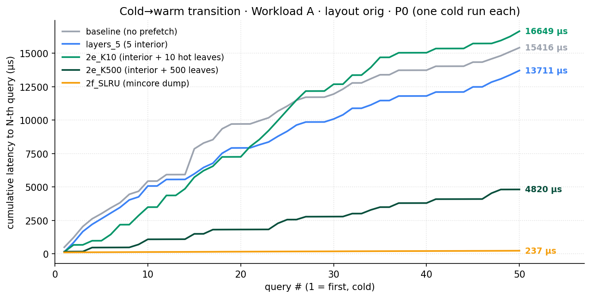

*圖 3：前 50 筆 query 的累計時間。Prefetch 把「cold→warm」的過渡時間整段
壓掉；第 50 筆之後所有方法都 converge 到 ~1.5 µs/query。*

### A.2 Workload Z robustness check（低 id hotspot 變體）

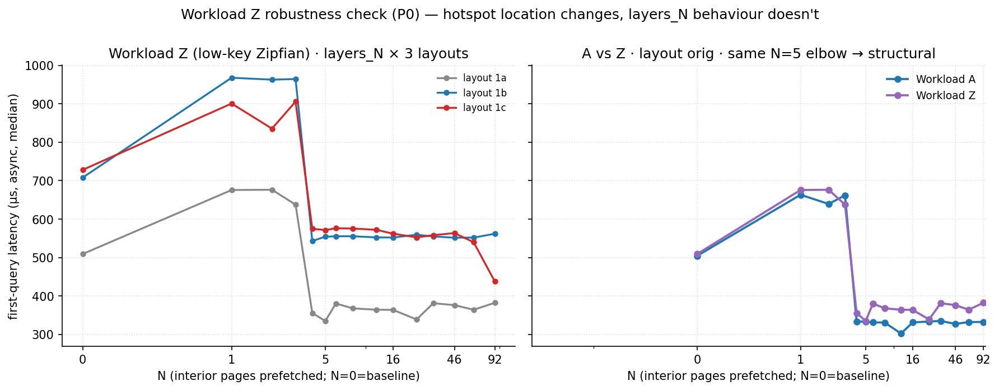

*圖 9：把 hotspot 從 [8, 99997] 移到 [1, 1000]（低 id 區段）的 robustness
check。N-sweep 形狀跟 Workload A 同形（差 ≤ 5pp）——「hotspot 落在哪個 key
區段」不是 prefetch 效益的主要變因。*

### A.3 Interior:leaf 比例掃描（3a/3b ratio variants）

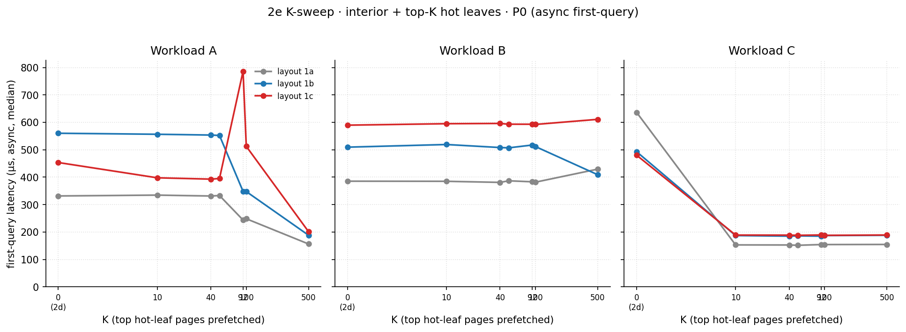

*圖 10：Load interior 跟 hot leaf 的比例（K=10/40/50/92/100/500）。**K 才是主要變因，ratio 不是**，A 上 K=500 才追平、C 上 K=10 就 saturate。*

### A.4 Dense N=0..92 sweep（rigor pass）

完整數據 + 兩張 9-cell grid 圖在 [figures/out/11_nsweep_full.png](https://github.com/wongzinc/sqlite-research-project-sharing/blob/main/figures/out/11_nsweep_full.png)
（clean DB, A/B/C × 1a/1b/1c）跟 [figures/out/12_nsweep_full_churn.png](https://github.com/wongzinc/sqlite-research-project-sharing/blob/main/figures/out/12_nsweep_full_churn.png)
（churn DB, A/B/C）。Sparse 6-pt 跟 dense 93-pt slice的對照、9/12 cell 結論
不變但 3 個 sweet spot 被漏掉的分析，見 [overall_strategies.md](https://github.com/wongzinc/sqlite-research-project-sharing/blob/main/overall_strategies.md) 2c bullet 跟
[overall_workloads.md](https://github.com/wongzinc/sqlite-research-project-sharing/blob/main/overall_workloads.md) 「已完成的覆蓋」表。

---
